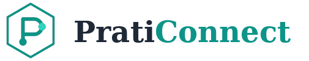

<p align="center">
  
</p>

<h1 align="center">PratiConnect</h1>

<p align="center">
  <strong>🇫🇷 Moins d'administratif, plus de soin</strong><br>
  <strong>🇬🇧 Less admin, more care</strong><br>
  <strong>🇮🇱 פחות ביורוקרטיה, יותר טיפול</strong>
</p>

<p align="center">
  <a href="https://praticonnect.com">Website</a> •
  <a href="#-français">Français</a> •
  <a href="#-english">English</a> •
  <a href="#-עברית">עברית</a> •
  <a href="CHANGELOG.md">Changelog</a> •
  <a href="CONTRIBUTING.md">Contributing</a>
</p>

<p align="center">
  
  
  
  
  
</p>

---

## 🇫🇷 Français

### À propos

**PratiConnect** est la plateforme tout-en-un conçue pour les praticiens du bien-être et des médecines alternatives en France. Elle réunit gestion de patientèle, facturation, prise de rendez-vous, téléconsultation et paiements intégrés dans une interface unifiée, conforme aux réglementations européennes.

> **Ce dépôt** est le dépôt public de documentation et de contributions communautaires. Le code source de PratiConnect est hébergé dans un dépôt privé séparé.

### Le problème

Les praticiens du bien-être consacrent en moyenne **8 à 12 heures par semaine** aux tâches administratives, avec des outils fragmentés : agenda sur Google Calendar, facturation sur Excel, dossiers patients sur papier, paiements via terminaux déconnectés.

### Notre solution

| Fonctionnalité | Description |
|---|---|
| **Gestion de patientèle** | Dossiers structurés, antécédents, notes de consultation, objectifs thérapeutiques |
| **Agenda intelligent** | Synchronisation Google Calendar, rappels automatiques, créneaux en ligne |
| **Facturation complète** | Devis, factures, avoirs, export comptable, conformité Factur-X |
| **Paiements intégrés** | Via Viva.com — Commission 1,10–1,25%, la plus basse du marché |
| **Téléconsultation** | Vidéo sécurisée LiveKit, partage d'écran, sans installation patient |
| **Questionnaires dynamiques** | Builder drag-drop, logique conditionnelle, scoring, suivi d'évolution |
| **Signature électronique** | Consentements conformes eIDAS |
| **Body mapping** | Visualisation corporelle interactive avec annotations |
| **Multilingue natif** | Français, anglais, hébreu (RTL complet) |

### 38 spécialités ciblées

**Thérapies manuelles** — Ostéopathe, Kinésithérapeute, Chiropracteur, Réflexologue, Massothérapeute, Étiopathe, Fasciathérapeute, Praticien Shiatsu

**Médecines alternatives** — Naturopathe, Homéopathe, Acupuncteur, Praticien Ayurveda, Médecine traditionnelle chinoise

**Santé mentale & psychothérapie** — Psychologue, Psychothérapeute, Psychanalyste, Psychopraticien, Gestalt-thérapeute, Hypnothérapeute, Praticien en thérapies brèves, Sexothérapeute

**Bien-être & développement personnel** — Sophrologue, Coach de vie, Thérapeute holistique, Thérapeute psychocorporel, Psycho-énergéticien

**Nutrition** — Nutritionniste, Diététicien

**Énergie & thérapies sensorielles** — Énergéticien, Aromathérapeute, Sonothérapeute

**Thérapies créatives & éducatives** — Art-thérapeute, Graphothérapeute

**Mouvement & corps** — Coach sportif, Préparateur physique, Professeur de yoga, Instructeur méditation, Kinésiologue

### Stack technique

```
Frontend :  React 18 + TypeScript + Tailwind CSS + Radix UI
Backend :   Laravel 11 + PHP 8.3
Base :      PostgreSQL 16 (Row Level Security)
Infra :     Scaleway HDS + Google Cloud HDS (backup)
Paiements : Viva.com (ISV Partner)
Vidéo :     LiveKit (self-hosted)
SEO :       Next.js 16 (pages publiques)
Mobile :    React Native (Expo)
```

### Conformité

| Norme | Statut |
|---|---|
| **RGPD** | ✅ Conforme — Consentements, droit à l'oubli, portabilité |
| **HDS** | ✅ Hébergement certifié (Scaleway) — Certification complète prévue Q4 2026 |
| **eIDAS** | ✅ Signature électronique qualifiée |
| **Factur-X** | ✅ Facturation électronique conforme |

### Liens utiles

- 🌐 [praticonnect.com](https://praticonnect.com)
- 📧 contact@praticonnect.com
- 💼 [LinkedIn](https://linkedin.com/company/praticonnect)

---

## 🇬🇧 English

### About

**PratiConnect** is the all-in-one practice management platform designed for wellness and alternative medicine practitioners in France. It unifies patient management, billing, appointment scheduling, teleconsultation, and integrated payments in a single interface, compliant with European regulations.

> **This repository** is the public documentation and community contributions repository. PratiConnect's source code is hosted in a separate private repository.

### The problem

Wellness practitioners spend an average of **8 to 12 hours per week** on administrative tasks, using fragmented tools: scheduling on Google Calendar, billing on Excel, patient records on paper, payments through disconnected terminals.

### Our solution

| Feature | Description |
|---|---|
| **Patient management** | Structured records, medical history, consultation notes, therapeutic goals |
| **Smart scheduling** | Google Calendar sync, automatic reminders, online booking slots |
| **Full billing** | Quotes, invoices, credit notes, accounting export, Factur-X compliance |
| **Integrated payments** | Via Viva.com — 1.10–1.25% commission, lowest on the market |
| **Teleconsultation** | Secure LiveKit video, screen sharing, no patient installation required |
| **Dynamic questionnaires** | Drag-drop builder, conditional logic, scoring, progress tracking |
| **Electronic signature** | eIDAS-compliant consent forms |
| **Body mapping** | Interactive body visualization with annotations |
| **Native multilingual** | French, English, Hebrew (full RTL support) |

### 38 targeted specialties

**Manual therapies** — Osteopath, Physiotherapist, Chiropractor, Reflexologist, Massage Therapist, Etiopath, Fascia Therapist, Shiatsu Practitioner

**Alternative medicine** — Naturopath, Homeopath, Acupuncturist, Ayurveda Practitioner, Traditional Chinese Medicine

**Mental health & psychotherapy** — Psychologist, Psychotherapist, Psychoanalyst, Psychopractitioner, Gestalt Therapist, Hypnotherapist, Brief Therapy Practitioner, Sex Therapist

**Wellness & personal development** — Sophrologist, Life Coach, Holistic Therapist, Psycho-body Therapist, Psycho-energetician

**Nutrition** — Nutritionist, Dietitian

**Energy & sensory therapies** — Energy Healer, Aromatherapist, Sound Therapist

**Creative & educational therapies** — Art Therapist, Graphotherapist

**Movement & body** — Sports Coach, Physical Trainer, Yoga Teacher, Meditation Instructor, Kinesiologist

### Tech stack

```
Frontend:   React 18 + TypeScript + Tailwind CSS + Radix UI
Backend:    Laravel 11 + PHP 8.3
Database:   PostgreSQL 16 (Row Level Security)
Infra:      Scaleway HDS + Google Cloud HDS (backup)
Payments:   Viva.com (ISV Partner)
Video:      LiveKit (self-hosted)
SEO:        Next.js 16 (public pages)
Mobile:     React Native (Expo)
```

### Compliance

| Standard | Status |
|---|---|
| **GDPR** | ✅ Compliant — Consent management, right to erasure, portability |
| **HDS** | ✅ Certified hosting (Scaleway) — Full certification planned Q4 2026 |
| **eIDAS** | ✅ Qualified electronic signature |
| **Factur-X** | ✅ Compliant electronic invoicing |

### Useful links

- 🌐 [praticonnect.com](https://praticonnect.com)
- 📧 contact@praticonnect.com
- 💼 [LinkedIn](https://linkedin.com/company/praticonnect)

---

## 🇮🇱 עברית

<div dir="rtl">

### אודות

**PratiConnect** היא פלטפורמת ניהול קליניקה כוללת המיועדת למטפלים ברפואה משלימה ואלטרנטיבית בצרפת. היא מאחדת ניהול מטופלים, חיוב, תזמון פגישות, טלה-ייעוץ ותשלומים משולבים בממשק אחד, בהתאם לתקנות האירופיות.

> **מאגר זה** הוא מאגר התיעוד הציבורי ותרומות הקהילה. קוד המקור של PratiConnect מתארח במאגר פרטי נפרד.

### הבעיה

מטפלים ברפואה משלימה מקדישים בממוצע **8 עד 12 שעות בשבוע** למשימות ניהוליות, תוך שימוש בכלים מפוצלים: יומן ב-Google Calendar, חיוב ב-Excel, תיקי מטופלים על נייר, תשלומים דרך מסופים מנותקים.

### הפתרון שלנו

| תכונה | תיאור |
|---|---|
| **ניהול מטופלים** | רשומות מובנות, היסטוריה רפואית, הערות ייעוץ, יעדים טיפוליים |
| **תזמון חכם** | סנכרון Google Calendar, תזכורות אוטומטיות, משבצות הזמנה מקוונות |
| **חיוב מלא** | הצעות מחיר, חשבוניות, זיכויים, ייצוא חשבונאי |
| **תשלומים משולבים** | דרך Viva.com — עמלה 1.10–1.25%, הנמוכה בשוק |
| **טלה-ייעוץ** | וידאו מאובטח LiveKit, שיתוף מסך, ללא התקנה למטופל |
| **שאלונים דינמיים** | בנייה בגרירה, לוגיקה מותנית, ניקוד, מעקב התקדמות |
| **חתימה אלקטרונית** | טפסי הסכמה תואמי eIDAS |
| **מיפוי גוף** | הדמיה אינטראקטיבית עם הערות |
| **רב-לשוני מובנה** | צרפתית, אנגלית, עברית (תמיכה מלאה ב-RTL) |

### 38 התמחויות

**טיפולים ידניים** — אוסטאופתיה, פיזיותרפיה, כירופרקטיקה, רפלקסולוגיה, עיסוי, אטיופתיה, פאסציותרפיה, שיאצו

**רפואה אלטרנטיבית** — נטורופתיה, הומאופתיה, דיקור סיני, אאיורוודה, רפואה סינית מסורתית

**בריאות הנפש ופסיכותרפיה** — פסיכולוגיה, פסיכותרפיה, פסיכואנליזה, פסיכופרקטיקה, גשטלט תרפיה, היפנותרפיה, טיפולים קצרי מועד, סקסותרפיה

**רווחה ופיתוח אישי** — סופרולוגיה, אימון חיים, מטפל הוליסטי, טיפול פסיכו-גופני, פסיכו-אנרגטיקה

**תזונה** — תזונאי, דיאטנית

**אנרגיה וטיפולים חושיים** — מרפא באנרגיה, ארומתרפיה, סאונדתרפיה

**טיפולים יצירתיים וחינוכיים** — טיפול באמנות, גרפותרפיה

**תנועה וגוף** — מאמן כושר, מכין גופני, מורה יוגה, מדריך מדיטציה, קינסיולוגיה

### תאימות

| תקן | סטטוס |
|---|---|
| **RGPD/GDPR** | ✅ תואם — ניהול הסכמות, זכות למחיקה, ניידות |
| **HDS** | ✅ אירוח מוסמך (Scaleway) — הסמכה מלאה מתוכננת ל-Q4 2026 |
| **eIDAS** | ✅ חתימה אלקטרונית מוסמכת |

### קישורים שימושיים

- 🌐 [praticonnect.com](https://praticonnect.com)
- 📧 contact@praticonnect.com
- 💼 [LinkedIn](https://linkedin.com/company/praticonnect)

</div>

---

## 📂 Repository structure / Structure du dépôt / מבנה המאגר

```
├── README.md                  # This file
├── CHANGELOG.md               # Version history
├── CONTRIBUTING.md             # Contribution guidelines
├── SECURITY.md                # Security policy
├── CODE_OF_CONDUCT.md         # Community guidelines
├── LICENSE                    # Proprietary license
├── .github/
│   └── PULL_REQUEST_TEMPLATE.md
├── assets/
│   └── logo-praticonnect.png
└── docs/
    ├── fr/                    # Documentation FR
    ├── en/                    # Documentation EN
    └── he/                    # Documentation HE
```

---

## ⚖️ License / Licence / רישיון

**© 2024–2026 QR Communication (SAS) — SIREN 940 163 496**

PratiConnect is proprietary software. All rights reserved. See [LICENSE](LICENSE) for details.

PratiConnect est un logiciel propriétaire. Tous droits réservés. Voir [LICENSE](LICENSE).

PratiConnect הוא תוכנה קניינית. כל הזכויות שמורות. ראה [LICENSE](LICENSE).

---

<p align="center">
  <strong>PratiConnect</strong> — Une marque <a href="https://qrcommunication.com">QR Communication</a><br>
  113 Boulevard Eugène Decros, 93260 Les Lilas, France<br>
  <a href="mailto:contact@praticonnect.com">contact@praticonnect.com</a> • +33 7 69 01 36 67
</p>
