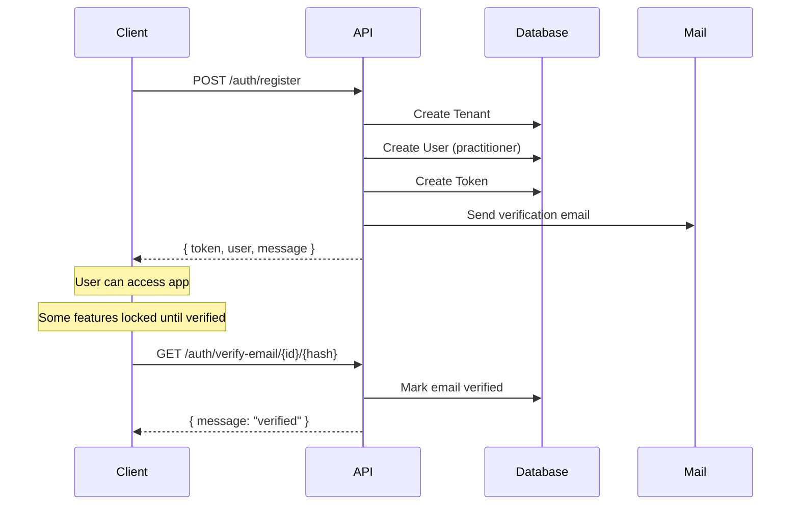
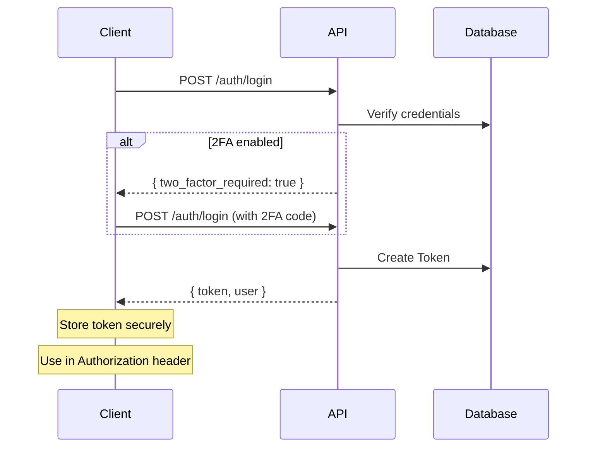

# API Authentication - PratiConnect

> Documentation des endpoints d'authentification et gestion des tokens.

---

## Table des matieres

1. [Vue d'ensemble](#1-vue-densemble)
2. [Flow d'authentification](#2-flow-dauthentification)
3. [Endpoints](#3-endpoints)
4. [Gestion des tokens](#4-gestion-des-tokens)
5. [Two-Factor Authentication](#5-two-factor-authentication)
6. [Erreurs communes](#6-erreurs-communes)

---

## 1. Vue d'ensemble

PratiConnect utilise **Laravel Sanctum** pour l'authentification API. Deux modes sont supportes :

| Mode | Usage | Methode |
|------|-------|---------|
| **SPA** | Frontend React sur meme domaine | Session cookies |
| **API Token** | Mobile, integrations tierces | Bearer token |

### Headers requis

```http
Accept: application/json
Content-Type: application/json
Authorization: Bearer {token}   # Pour les routes authentifiees
```

### Base URL

| Environnement | URL |
|---------------|-----|
| Local | `http://localhost:8000/api/v1` |
| Production | `https://praticonnect.com/api/v1` |

---

## 2. Flow d'authentification

### 2.1 Inscription praticien



### 2.2 Connexion



---

## 3. Endpoints

### 3.1 Register - Inscription praticien

Cree un compte praticien avec son cabinet (tenant).

**Endpoint:** `POST /api/v1/auth/register`

**Body:**

```json
{
  "practice_name": "Cabinet Dupont",
  "country_code": "FR",
  "timezone": "Europe/Paris",
  "currency": "EUR",
  "first_name": "Sophie",
  "last_name": "Martin",
  "email": "sophie.martin@example.com",
  "password": "SecurePass123!",
  "password_confirmation": "SecurePass123!",
  "phone": "+33612345678",
  "locale": "fr",
  "title": "Dr.",
  "specialty_ids": ["550e8400-e29b-41d4-a716-446655440000"],
  "device_name": "iPhone 15 Pro"
}
```

**Curl:**

```bash
curl -X POST https://praticonnect.com/api/v1/auth/register \
  -H "Content-Type: application/json" \
  -H "Accept: application/json" \
  -d '{
    "practice_name": "Cabinet Dupont",
    "country_code": "FR",
    "first_name": "Sophie",
    "last_name": "Martin",
    "email": "sophie.martin@example.com",
    "password": "SecurePass123!",
    "password_confirmation": "SecurePass123!"
  }'
```

**Response 201:**

```json
{
  "message": "Registration successful. Please verify your email.",
  "data": {
    "token": "1|abc123def456...",
    "user": {
      "id": "550e8400-e29b-41d4-a716-446655440001",
      "email": "sophie.martin@example.com",
      "first_name": "Sophie",
      "last_name": "Martin",
      "role": "practitioner",
      "email_verified_at": null,
      "tenant": {
        "id": "550e8400-e29b-41d4-a716-446655440002",
        "name": "Cabinet Dupont",
        "slug": "cabinet-dupont"
      }
    }
  }
}
```

**Validation errors (422):**

```json
{
  "message": "The given data was invalid.",
  "errors": {
    "email": ["The email has already been taken."],
    "password": ["The password must be at least 8 characters."]
  }
}
```

---

### 3.2 Login - Connexion

Authentifie un utilisateur et retourne un token.

**Endpoint:** `POST /api/v1/auth/login`

**Body:**

```json
{
  "email": "sophie.martin@example.com",
  "password": "SecurePass123!",
  "device_name": "iPhone 15 Pro"
}
```

**Curl:**

```bash
curl -X POST https://praticonnect.com/api/v1/auth/login \
  -H "Content-Type: application/json" \
  -H "Accept: application/json" \
  -d '{
    "email": "sophie.martin@example.com",
    "password": "SecurePass123!"
  }'
```

**Response 200:**

```json
{
  "message": "Login successful.",
  "data": {
    "token": "2|xyz789ghi012...",
    "user": {
      "id": "550e8400-e29b-41d4-a716-446655440001",
      "email": "sophie.martin@example.com",
      "first_name": "Sophie",
      "last_name": "Martin",
      "role": "practitioner",
      "email_verified_at": "2026-02-01T10:00:00Z",
      "two_factor_enabled": false,
      "tenant": {
        "id": "550e8400-e29b-41d4-a716-446655440002",
        "name": "Cabinet Dupont"
      },
      "specialties": [
        {
          "id": "550e8400-e29b-41d4-a716-446655440000",
          "name": { "fr": "Naturopathie", "en": "Naturopathy" }
        }
      ]
    }
  }
}
```

**2FA required (403):**

```json
{
  "message": "2FA code is required.",
  "two_factor_required": true
}
```

**Invalid credentials (401):**

```json
{
  "message": "Invalid credentials."
}
```

---

### 3.3 Login with 2FA

Si 2FA est active, fournir le code TOTP ou un code de recuperation.

**Body avec TOTP:**

```json
{
  "email": "sophie.martin@example.com",
  "password": "SecurePass123!",
  "two_factor_code": "123456"
}
```

**Body avec recovery code:**

```json
{
  "email": "sophie.martin@example.com",
  "password": "SecurePass123!",
  "recovery_code": "abcd-efgh-ijkl"
}
```

**Curl:**

```bash
curl -X POST https://praticonnect.com/api/v1/auth/login \
  -H "Content-Type: application/json" \
  -d '{
    "email": "sophie.martin@example.com",
    "password": "SecurePass123!",
    "two_factor_code": "123456"
  }'
```

---

### 3.4 Logout - Deconnexion

Revoque le token actuel.

**Endpoint:** `POST /api/v1/auth/logout`

**Headers:** `Authorization: Bearer {token}`

**Curl:**

```bash
curl -X POST https://praticonnect.com/api/v1/auth/logout \
  -H "Authorization: Bearer 2|xyz789ghi012..."
```

**Response 200:**

```json
{
  "message": "Logout successful."
}
```

---

### 3.5 Me - Profil utilisateur

Retourne le profil de l'utilisateur authentifie.

**Endpoint:** `GET /api/v1/auth/me`

**Headers:** `Authorization: Bearer {token}`

**Curl:**

```bash
curl https://praticonnect.com/api/v1/auth/me \
  -H "Authorization: Bearer 2|xyz789ghi012..."
```

**Response 200:**

```json
{
  "data": {
    "id": "550e8400-e29b-41d4-a716-446655440001",
    "email": "sophie.martin@example.com",
    "first_name": "Sophie",
    "last_name": "Martin",
    "phone": "+33612345678",
    "role": "practitioner",
    "locale": "fr",
    "title": "Dr.",
    "email_verified_at": "2026-02-01T10:00:00Z",
    "two_factor_enabled": false,
    "subscription_status": "trial",
    "trial_ends_at": "2026-02-15T10:00:00Z",
    "tenant": {
      "id": "550e8400-e29b-41d4-a716-446655440002",
      "name": "Cabinet Dupont",
      "slug": "cabinet-dupont",
      "timezone": "Europe/Paris",
      "currency": "EUR"
    },
    "specialties": []
  }
}
```

---

### 3.6 Refresh Token

Revoque le token actuel et en cree un nouveau.

**Endpoint:** `POST /api/v1/auth/refresh`

**Headers:** `Authorization: Bearer {token}`

**Body (optionnel):**

```json
{
  "device_name": "New Device"
}
```

**Curl:**

```bash
curl -X POST https://praticonnect.com/api/v1/auth/refresh \
  -H "Authorization: Bearer 2|xyz789ghi012..." \
  -H "Content-Type: application/json"
```

**Response 200:**

```json
{
  "message": "Token refreshed successfully.",
  "data": {
    "token": "3|new_token_here...",
    "user": { ... }
  }
}
```

---

### 3.7 Password Reset - Demande

Envoie un email avec lien de reinitialisation.

**Endpoint:** `POST /api/v1/auth/forgot-password`

**Body:**

```json
{
  "email": "sophie.martin@example.com"
}
```

**Curl:**

```bash
curl -X POST https://praticonnect.com/api/v1/auth/forgot-password \
  -H "Content-Type: application/json" \
  -d '{"email": "sophie.martin@example.com"}'
```

**Response 200:**

```json
{
  "message": "Password reset link sent."
}
```

---

### 3.8 Password Reset - Execution

Reinitialise le mot de passe avec le token recu par email.

**Endpoint:** `POST /api/v1/auth/reset-password`

**Body:**

```json
{
  "token": "abc123...",
  "email": "sophie.martin@example.com",
  "password": "NewSecurePass456!",
  "password_confirmation": "NewSecurePass456!"
}
```

**Response 200:**

```json
{
  "message": "Password reset successfully."
}
```

---

### 3.9 Email Verification - Resend

Renvoie l'email de verification.

**Endpoint:** `POST /api/v1/auth/email/resend`

**Headers:** `Authorization: Bearer {token}`

**Curl:**

```bash
curl -X POST https://praticonnect.com/api/v1/auth/email/resend \
  -H "Authorization: Bearer 2|xyz789ghi012..."
```

**Response 200:**

```json
{
  "message": "Verification email sent."
}
```

**Already verified (400):**

```json
{
  "message": "Email already verified."
}
```

---

### 3.10 Email Verification - Confirm

Verifie l'email via le lien recu.

**Endpoint:** `GET /api/v1/auth/verify-email/{id}/{hash}?expires={timestamp}&signature={sig}`

Note: Ce lien est genere automatiquement dans l'email et contient une signature.

**Response 200:**

```json
{
  "message": "Email verified successfully."
}
```

---

## 4. Gestion des tokens

### 4.1 Stockage securise

| Plateforme | Recommandation |
|------------|----------------|
| **Web SPA** | Memory (pas localStorage) |
| **Mobile** | Secure storage (Keychain/Keystore) |
| **Backend** | Variables d'environnement |

### 4.2 Expiration

Les tokens Sanctum n'expirent pas par defaut. Pour forcer l'expiration :

```php
// config/sanctum.php
'expiration' => 60 * 24, // 24 heures
```

### 4.3 Revocation

```bash
# Revoquer le token actuel
POST /api/v1/auth/logout

# Revoquer tous les tokens (via /me endpoint + action)
DELETE /api/v1/auth/tokens
```

### 4.4 Device tracking

Chaque token est associe a un `device_name` :

```json
{
  "device_name": "iPhone 15 Pro"
}
```

Utile pour afficher les appareils connectes et revoquer selectivement.

---

## 5. Two-Factor Authentication

### 5.1 Activer 2FA

**Endpoint:** `POST /api/v1/auth/2fa/enable`

**Response:**

```json
{
  "secret": "JBSWY3DPEHPK3PXP",
  "qr_code_url": "otpauth://totp/PratiConnect:sophie@example.com?secret=JBSWY3DPEHPK3PXP"
}
```

### 5.2 Confirmer 2FA

**Endpoint:** `POST /api/v1/auth/2fa/confirm`

**Body:**

```json
{
  "code": "123456"
}
```

**Response:**

```json
{
  "message": "2FA enabled successfully.",
  "recovery_codes": [
    "abcd-efgh-ijkl",
    "mnop-qrst-uvwx",
    "yz12-3456-7890"
  ]
}
```

### 5.3 Desactiver 2FA

**Endpoint:** `DELETE /api/v1/auth/2fa/disable`

**Body:**

```json
{
  "password": "CurrentPassword123!"
}
```

---

## 6. Erreurs communes

### 6.1 Codes HTTP

| Code | Signification | Action |
|------|---------------|--------|
| 200 | Succes | - |
| 201 | Cree | - |
| 400 | Bad request | Verifier le body |
| 401 | Non authentifie | Renouveler le token |
| 403 | Interdit / 2FA requis | Fournir 2FA ou verifier permissions |
| 404 | Non trouve | Verifier l'URL |
| 422 | Validation echouee | Corriger les champs |
| 429 | Rate limited | Attendre et reessayer |
| 500 | Erreur serveur | Contacter le support |

### 6.2 Troubleshooting

**"Unauthenticated" sur routes protegees:**

```bash
# Verifier le header
Authorization: Bearer YOUR_TOKEN

# Verifier que le token n'est pas expire ou revoque
curl https://praticonnect.com/api/v1/auth/me \
  -H "Authorization: Bearer YOUR_TOKEN"
```

**"Your email address is not verified":**

```bash
# Renvoyer l'email de verification
curl -X POST https://praticonnect.com/api/v1/auth/email/resend \
  -H "Authorization: Bearer YOUR_TOKEN"
```

**"Too many requests":**

Rate limiting actif. Attendre 60 secondes avant de reessayer.

| Endpoint | Limite |
|----------|--------|
| `/auth/login` | 5 tentatives / minute |
| `/auth/register` | 3 tentatives / minute |
| `/auth/forgot-password` | 3 tentatives / minute |

**"Invalid 2FA code":**

- Verifier que l'heure du device est synchronisee (NTP)
- Utiliser un code de recuperation si disponible

---

## Voir aussi

- [Architecture Overview](/docs/architecture/OVERVIEW.md) - Vue d'ensemble
- [CONTRIBUTING](/docs/CONTRIBUTING.md) - Guide contribution
- [Swagger UI](http://localhost:8000/api/documentation) - Documentation interactive

---

*Document mis a jour : 2026-02-05*
