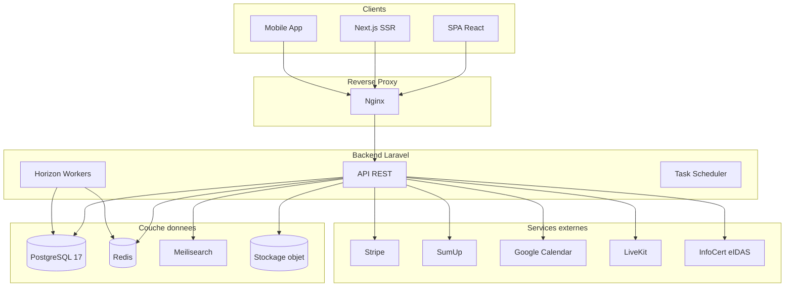
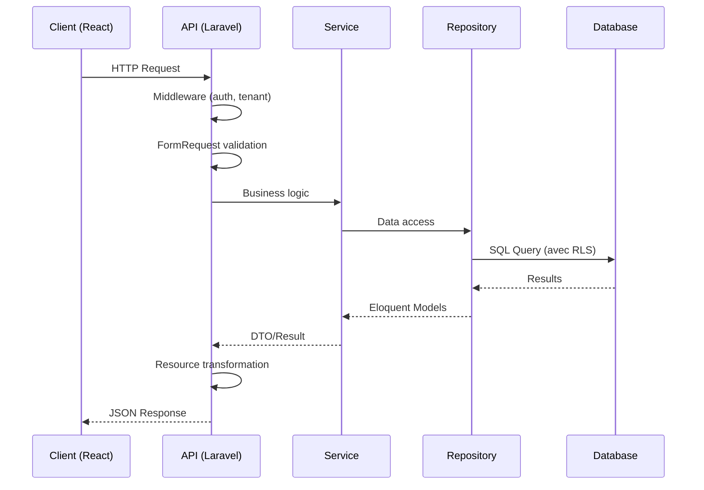
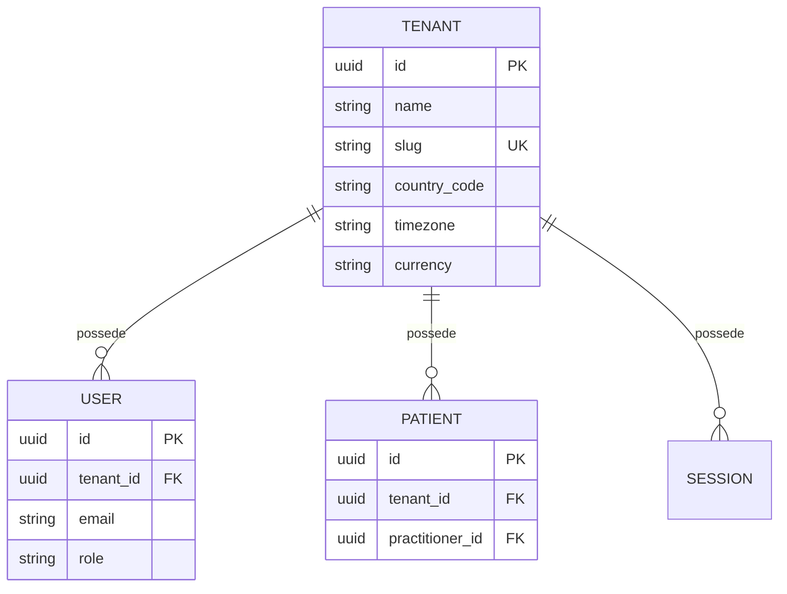
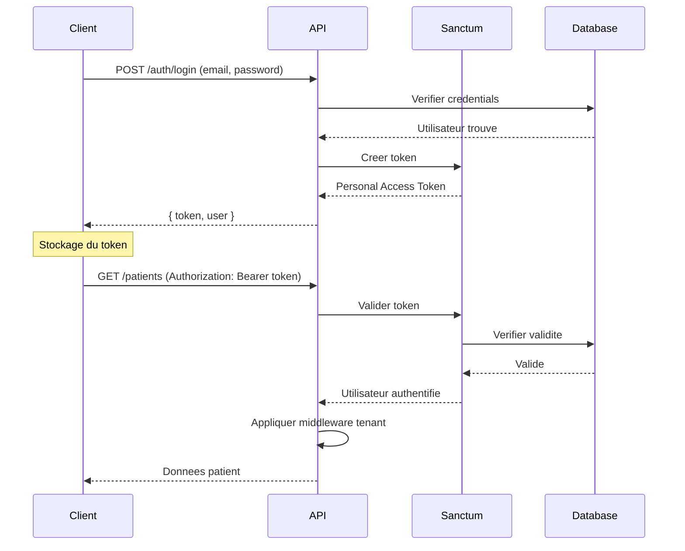
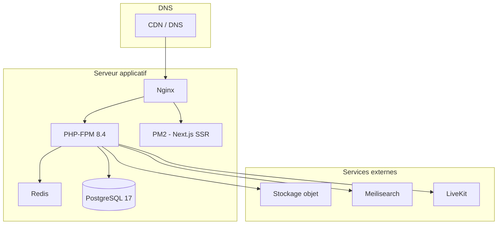

# Architecture technique

> Vue d'ensemble de l'architecture technique de PratiConnect.

---

## Table des matieres

1. [Vue d'ensemble](#1-vue-densemble)
2. [Stack technique](#2-stack-technique)
3. [Architecture applicative](#3-architecture-applicative)
4. [Patterns et decisions](#4-patterns-et-decisions)
5. [Multi-tenancy](#5-multi-tenancy)
6. [Securite](#6-securite)
7. [Infrastructure](#7-infrastructure)

---

## 1. Vue d'ensemble

PratiConnect est une plateforme SaaS de gestion de patientele pour les professionnels du bien-etre et des medecines alternatives.

### Diagramme d'architecture



### Chiffres cles

| Element | Nombre |
|---------|--------|
| Modeles Eloquent | 115 |
| Controllers API | 129 |
| Services metier | 102 |
| Form Requests | 131 |
| API Resources | 112 |
| Enumerations | 54 |
| Policies | 33 |
| Tables DB | 149 |
| Routes API | 928 |

---

## 2. Stack technique

### 2.1 Versions par composant

| Composant | Version | Role |
|-----------|---------|------|
| **PHP** | 8.4 | Runtime FPM |
| **Laravel** | 12.x | Framework applicatif |
| **PostgreSQL** | 17.x | Base de donnees principale |
| **Redis** | 7.x / 8.x | Cache, sessions, queues |
| **Meilisearch** | Latest | Recherche full-text |
| **React** | 19.0 | Frontend SPA |
| **TypeScript** | 5.7 | Typage frontend |
| **Node.js** | 22.x | Build tooling et SSR |

### 2.2 Dependances backend cles

```
laravel/sanctum      ^4.2    # Authentification API
laravel/horizon      ^5.41   # Gestion des queues
laravel/scout        ^10.23  # Integration Meilisearch
spatie/permission    ^6.24   # Roles et permissions
stripe/stripe-php    ^19.1   # Paiements Stripe
agence104/livekit    ^1.3    # Teleconsultation
darkaonline/l5-swagger ^9.0  # Documentation OpenAPI
```

### 2.3 Dependances frontend cles

```
@tanstack/react-query  ^5.62  # Data fetching
zustand                ^5.0   # State management
@radix-ui/*            ^1-2   # Composants UI accessibles
react-hook-form        ^7.54  # Formulaires
zod                    ^3.24  # Validation schemas
i18next                ^24.2  # Internationalisation
@livekit/components    ^2.16  # Composants video
```

---

## 3. Architecture applicative

### 3.1 Structure backend

```
app/
+-- Http/
|   +-- Controllers/
|   |   +-- Admin/           # 15 controllers administration
|   |   +-- Api/V1/          # 114 controllers API
|   |       +-- Auth/        # Authentification (3)
|   |       +-- Goals/       # Objectifs therapeutiques (5)
|   |       +-- PatientPortal/ # Portail patient (11)
|   |       +-- TherapeuticMedia/ # Medias therapeutiques (8)
|   |       +-- Webhook/     # Callbacks externes (3)
|   +-- Middleware/          # 7 middlewares
|   +-- Requests/            # 131 Form Requests
|   +-- Resources/           # 112 API Resources
+-- Models/                  # 115 modeles Eloquent
+-- Services/                # 102 services metier
|   +-- Admin/               # Services administration (6)
|   +-- Anamnesis/           # Services anamnese (5)
|   +-- Billing/             # Services facturation (10)
|   +-- BodyMapping/         # Cartographie corporelle (2)
|   +-- Calendar/            # Calendrier (4)
|   +-- Encryption/          # Chiffrement (3)
|   +-- Patient/             # Gestion patients (2)
|   +-- Signature/           # Signature electronique (3)
|   +-- Teleconsultation/    # Visio (3)
+-- Policies/                # 33 policies d'autorisation
+-- Enums/                   # 54 enumerations
+-- Jobs/                    # 10 jobs asynchrones
+-- Mail/                    # 24 classes mail
+-- OpenApi/Schemas/         # 46 schemas Swagger
```

### 3.2 Structure frontend

```
frontend/src/
+-- api/                     # Clients API + React Query hooks
+-- components/
|   +-- ui/                  # Composants atomiques (Button, Input...)
|   +-- forms/               # Composants formulaire
|   +-- layout/              # Layout (Sidebar, Header...)
|   +-- features/            # Composants metier
+-- hooks/                   # Hooks custom
+-- lib/                     # Utilitaires (i18n, dates...)
+-- pages/
|   +-- admin/               # Pages administration
|   +-- patient/             # Portail patient
|   +-- practitioner/        # Application praticien
+-- stores/                  # Zustand stores
+-- types/                   # Definitions TypeScript
```

### 3.3 Flux de donnees



---

## 4. Patterns et decisions

### 4.1 Architecture Decision Records (ADR)

#### ADR-001 : Multi-tenant avec PostgreSQL RLS

**Contexte :** Isolation des donnees entre cabinets (tenants).

**Decision :** Utiliser Row Level Security (RLS) de PostgreSQL plutot qu'un scope applicatif seul.

**Consequences :**
- Isolation garantie au niveau base de donnees
- Performance optimale avec les index
- Complexite accrue des migrations

```sql
-- Politique RLS sur chaque table tenant
CREATE POLICY tenant_isolation ON patients
USING (tenant_id = current_setting('app.current_tenant', true)::uuid)
```

#### ADR-002 : Credits au niveau User, pas Tenant

**Contexte :** Gestion des credits (signature, SMS, stockage).

**Decision :** Stocker les credits sur le modele `User`, pas `Tenant`.

**Consequences :**
- Permet la facturation individuelle
- Le Tenant ne sert qu'au partage entre utilisateurs
- Simplifie la migration vers un modele B2C

#### ADR-003 : Radix UI prioritaire

**Contexte :** Choix des composants UI.

**Decision :** Utiliser les composants Radix UI avant toute solution custom.

**Consequences :**
- Accessibilite garantie (WCAG 2.1)
- Coherence visuelle
- Moins de maintenance de composants custom

#### ADR-004 : TanStack Query pour le data fetching

**Contexte :** Gestion de l'etat serveur cote frontend.

**Decision :** Utiliser TanStack Query (React Query) pour toutes les requetes API.

**Consequences :**
- Cache automatique et deduplication
- Gestion des etats loading/error
- Invalidation fine du cache
- Optimistic updates simplifies

#### ADR-005 : Zustand pour le state global

**Contexte :** Gestion de l'etat client-side.

**Decision :** Utiliser Zustand pour l'etat global (preferences UI, session utilisateur).

**Consequences :**
- API simple et legere
- Pas de boilerplate Redux
- Compatible avec React 19

### 4.2 Patterns utilises

| Pattern | Usage | Exemple |
|---------|-------|---------|
| **Repository** | Abstraction data access | `PatientRepository`, `SessionRepository` |
| **Service Layer** | Logique metier | `BillingManager`, `SignatureService` |
| **Form Request** | Validation input | `CreatePatientRequest` |
| **API Resource** | Transformation output | `PatientResource`, `SessionResource` |
| **Policy** | Autorisation | `PatientPolicy::update()` |
| **Scope** | Filtrage Eloquent | `TenantScope` |
| **Trait** | Comportements partages | `BelongsToTenant`, `HasI18nFields` |

---

## 5. Multi-tenancy

### 5.1 Architecture



### 5.2 Implementation

**Trait BelongsToTenant :**

```php
trait BelongsToTenant
{
    public static function bootBelongsToTenant(): void
    {
        static::addGlobalScope(new TenantScope);

        static::creating(function ($model) {
            if (empty($model->tenant_id)) {
                $model->tenant_id = app('current_tenant_id');
            }
        });
    }
}
```

**Middleware Tenant :**

```php
public function handle($request, Closure $next)
{
    $user = $request->user();

    if ($user && $user->tenant_id) {
        // Definir le contexte RLS PostgreSQL
        DB::statement("SET app.current_tenant = '{$user->tenant_id}'");

        // Definir le contexte Laravel
        app()->instance('current_tenant_id', $user->tenant_id);
    }

    return $next($request);
}
```

### 5.3 Tables sans RLS

Certaines tables sont globales (pas de `tenant_id`) :

- `tenants` - Definition des tenants
- `subscription_plans` - Plans d'abonnement
- `specialties` - Specialites medicales
- `admin_users` - Administrateurs plateforme
- `newsletter_subscribers` - Abonnes newsletter

---

## 6. Securite

### 6.1 Authentification



### 6.2 Couches de securite

| Couche | Implementation |
|--------|----------------|
| **Transport** | HTTPS obligatoire |
| **Authentification** | Laravel Sanctum + 2FA optionnel |
| **Autorisation** | Policies Laravel |
| **Isolation tenant** | PostgreSQL RLS |
| **Validation input** | Form Requests + Zod |
| **Chiffrement donnees** | KMS pour champs sensibles |
| **Rate limiting** | Throttle middleware |
| **Audit** | Logs d'activite |

### 6.3 Conformite

| Norme | Application |
|-------|-------------|
| **RGPD** | Consentement, droit a l'oubli, export |
| **HDS** | Hebergement de donnees de sante |
| **eIDAS** | Signature electronique qualifiee |
| **Factur-X** | Format de facturation electronique |

---

## 7. Infrastructure

### 7.1 Architecture de production



### 7.2 Routage des requetes

| Requete | Destination |
|---------|-------------|
| `/` et pages publiques | Next.js SSR (via PM2) |
| `/practitioner/*`, `/patient/*`, `/admin/*` | SPA React (fichiers statiques) |
| `/api/*` | Laravel API (PHP-FPM) |
| `/webhooks/*` | Laravel (callbacks externes) |

### 7.3 Monitoring

| Outil | Usage |
|-------|-------|
| **Horizon** | Monitoring des queues |
| **Pail** | Logs temps reel |
| **Telescope** | Debug (developpement uniquement) |
| **Sentry** | Suivi des erreurs |

---

## Voir aussi

- [Structure applicative](APPLICATION_STRUCTURE.md) - Navigation, layouts et modules
- [Design system](DESIGN_SYSTEM.md) - Charte graphique et composants
- [Portail patient](PATIENT_PORTAL_ARCHITECTURE.md) - Architecture du portail

---

*Mis a jour : mars 2026*
