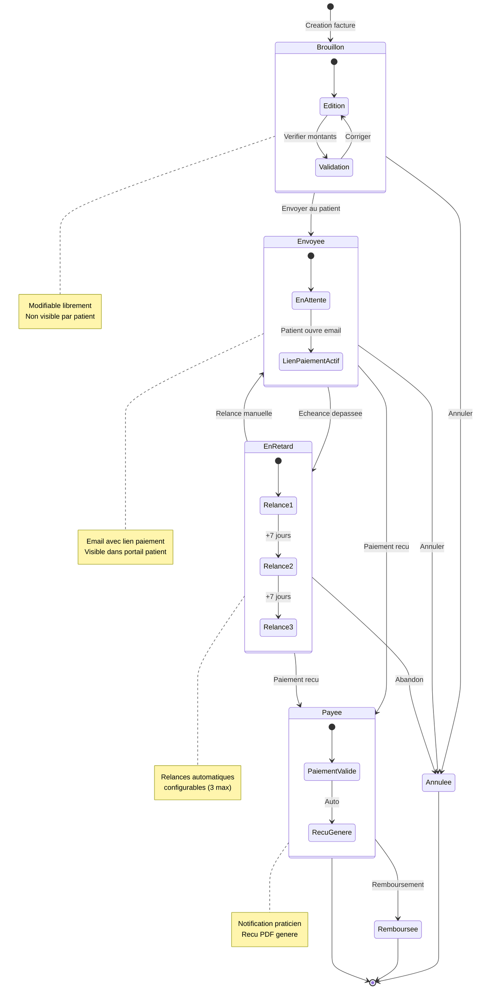

# Cycle de Vie Facture - PratiConnect

## Description

Diagramme d'etats representant le cycle de vie complet d'une facture dans PratiConnect, de la creation au paiement ou annulation.

## Diagramme



## Etats Detailles

### Brouillon (draft)

| Attribut | Valeur |
|----------|--------|
| Modifiable | Oui, completement |
| Visible patient | Non |
| Paiement possible | Non |
| Delai auto | Aucun |

**Actions disponibles:**
- Editer lignes et montants
- Ajouter/supprimer actes
- Envoyer au patient
- Annuler

### Envoyee (sent)

| Attribut | Valeur |
|----------|--------|
| Modifiable | Non (sauf annulation) |
| Visible patient | Oui, dans portail |
| Paiement possible | Oui |
| Delai auto | Passage en retard apres echeance |

**Actions disponibles:**
- Renvoyer email
- Copier lien paiement
- Annuler
- Marquer comme payee (paiement manuel)

### En Retard (overdue)

| Attribut | Valeur |
|----------|--------|
| Modifiable | Non |
| Visible patient | Oui, avec alerte |
| Paiement possible | Oui |
| Delai auto | Relances automatiques |

**Configuration relances:**
```
Relance 1: J+3 apres echeance (email)
Relance 2: J+10 apres echeance (email + SMS optionnel)
Relance 3: J+17 apres echeance (email final)
```

**Actions disponibles:**
- Relance manuelle
- Annuler
- Marquer comme payee

### Payee (paid)

| Attribut | Valeur |
|----------|--------|
| Modifiable | Non |
| Visible patient | Oui, avec recu |
| Paiement possible | N/A |
| Delai auto | Aucun |

**Actions disponibles:**
- Telecharger PDF
- Envoyer recu par email
- Rembourser (partiel ou total)

### Annulee (cancelled)

| Attribut | Valeur |
|----------|--------|
| Modifiable | Non |
| Visible patient | Non |
| Paiement possible | Non |
| Delai auto | Aucun |

**Note:** Une facture annulee garde son numero. Si besoin, creer une nouvelle facture.

### Remboursee (refunded)

| Attribut | Valeur |
|----------|--------|
| Modifiable | Non |
| Visible patient | Oui, avec mention |
| Paiement possible | N/A |
| Delai auto | Aucun |

## Transitions

| De | Vers | Declencheur | Notification |
|----|------|-------------|--------------|
| Brouillon | Envoyee | Action praticien | Email patient |
| Brouillon | Annulee | Action praticien | Aucune |
| Envoyee | Payee | Webhook paiement | Email praticien + patient |
| Envoyee | EnRetard | Cron job quotidien | Email patient |
| Envoyee | Annulee | Action praticien | Email patient |
| EnRetard | Payee | Webhook paiement | Email praticien + patient |
| EnRetard | Envoyee | Relance manuelle | Email patient |
| EnRetard | Annulee | Action praticien | Email patient |
| Payee | Remboursee | Action praticien | Email patient |

## Modes de Paiement

| Mode | Tracking Auto | Webhook |
|------|---------------|---------|
| Carte bancaire (Viva.com) | Oui | `payment.succeeded` |
| Carte bancaire (Stripe) | Oui | `payment_intent.succeeded` |
| Virement | Non | Manuel |
| Especes | Non | Manuel |
| Cheque | Non | Manuel |

## Usage

- Document cible: `/docs/public/tutorials/facturation-viva.md`
- Reference: Guide facturation praticien

## Notes

- Les factures respectent le format Factur-X pour conformite
- Les numeros de facture sont sequentiels et uniques par praticien
- L'historique des changements d'etat est trace (audit log)
- Les relances automatiques peuvent etre desactivees par praticien
