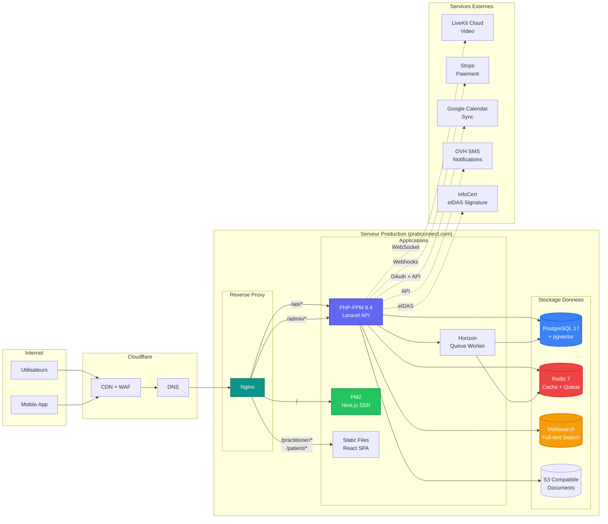

# Architecture de Deploiement - PratiConnect

## Description

Architecture de deploiement production PratiConnect. Illustre le flux des requetes utilisateurs et l'interconnexion des composants infrastructure sur serveur Ploi.

## Diagramme



## Composants

### Reverse Proxy (Nginx)

| Route | Backend | Description |
|-------|---------|-------------|
| `/` | PM2 (Next.js) | Landing page SSR |
| `/api/*` | PHP-FPM | API Laravel |
| `/practitioner/*` | Static SPA | Dashboard praticien |
| `/patient/*` | Static SPA | Portail patient |
| `/portal/*` | Static SPA | Portail patient (alias) |
| `/admin/*` | PHP-FPM | Administration |
| `/webhooks/*` | PHP-FPM | Webhooks Stripe/Viva |
| `/sanctum/*` | PHP-FPM | Auth Sanctum |

### Applications

| Service | Port | Process Manager | Description |
|---------|------|-----------------|-------------|
| PHP-FPM | socket | systemd | API Laravel |
| Next.js | 3000 | PM2 | Landing SSR |
| Horizon | - | supervisor | Queue workers |

### Bases de Donnees

| Service | Port | Version | Usage |
|---------|------|---------|-------|
| PostgreSQL | 5432 | 17.7 | Donnees principales + RLS |
| Redis | 6379 | 7.0 | Cache, sessions, queues |
| Meilisearch | 7700 | latest | Recherche full-text |

### Stockage

| Type | Provider | Usage |
|------|----------|-------|
| S3 | Stockage objet compatible S3 | Documents, exports, backups |
| Local | /app/storage | Logs, cache files |

## Services Externes

| Service | Usage | Integration |
|---------|-------|-------------|
| **LiveKit** | Teleconsultation video | SDK PHP + WebRTC |
| **Stripe** | Paiement CB (hors IL) | Webhooks + API |
| **Viva.com** | Paiement CB (EU) | API REST |
| **Green Invoice** | Facturation Israel | API REST |
| **Google Calendar** | Sync agenda | OAuth 2.0 |
| **OVH SMS** | Notifications SMS | API REST |
| **InfoCert** | Signature eIDAS | API SOAP |

## Securite

| Couche | Protection |
|--------|------------|
| Cloudflare | WAF, DDoS protection, SSL termination |
| Nginx | Rate limiting, headers security |
| Laravel | Sanctum auth, CORS, validation |
| PostgreSQL | RLS (Row Level Security), SSL |

## Deploiement

```bash
# Via Ploi (automatise) ou manuellement:
cd /app
git pull origin main
composer install --no-dev --optimize-autoloader
php artisan migrate --force
php artisan config:cache && php artisan route:cache
pnpm install --frozen-lockfile && pnpm build
rm -rf public/app/* && cp -r apps/spa/dist/* public/app/
php artisan queue:restart
sudo service php8.4-fpm reload
```

## Usage

- Document cible: `/docs/deployment-guide.md`
- Reference: Guide d'administration systeme

## Notes

- Le serveur est gere via Ploi (panel de deploiement)
- Les backups PostgreSQL sont automatises quotidiennement
- Monitoring via Ploi + optionnel Sentry pour les erreurs
- SSL/TLS gere par Cloudflare (Full Strict mode)
