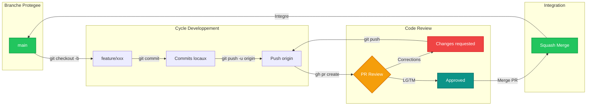

# Git Workflow - PratiConnect

## Description

Workflow de contribution Git pour les developpeurs PratiConnect. Illustre le flux complet depuis la creation d'une branche feature jusqu'au merge dans main.

## Diagramme



## Branches

| Branche | Description | Protection |
|---------|-------------|------------|
| `main` | Branche principale de production | Protegee, merge via PR uniquement |
| `feature/*` | Nouvelles fonctionnalites | Convention: `feature/description-courte` |
| `fix/*` | Corrections de bugs | Convention: `fix/description-bug` |
| `hotfix/*` | Corrections urgentes production | Peut bypasser develop |

## Regles de Contribution

1. **Creer une branche** depuis `main` avec un nom descriptif
2. **Commits atomiques** avec messages clairs (conventionnel commits recommande)
3. **Push regulier** vers origin pour backup et visibilite
4. **Ouvrir une PR** avec description detaillee et captures si UI
5. **Code Review obligatoire** - minimum 1 approbation requise
6. **Squash Merge** pour garder un historique propre

## Commandes Rapides

```bash
# Nouvelle feature
git checkout main && git pull
git checkout -b feature/ma-nouvelle-feature

# Commits
git add -p  # staging interactif
git commit -m "feat: description de la feature"

# Push et PR
git push -u origin feature/ma-nouvelle-feature
gh pr create --title "feat: Ma nouvelle feature" --body "Description..."

# Apres merge, nettoyer
git checkout main && git pull
git branch -d feature/ma-nouvelle-feature
```

## Usage

- Document cible: `/docs/CONTRIBUTING.md`
- Reference: Guide du contributeur

## Notes

- Les PRs doivent passer les checks CI (tests, lint) avant merge
- Le squash merge preserve un historique lineaire et propre
- Les branches sont supprimees automatiquement apres merge (configurable sur GitHub)
