# Onboarding Flow Praticien - PratiConnect

## Description

Parcours d'onboarding complet d'un nouveau praticien en 7 etapes cles. De l'inscription a la realisation de la premiere seance avec un patient.

## Diagramme

```mermaid
flowchart TD
    subgraph Inscription["1. Inscription"]
        A[Creer un compte]
        A1[Email + Mot de passe]
        A2[Accepter CGU]
    end

    subgraph Verification["2. Verification"]
        B[Confirmer email]
        B1[Cliquer lien email]
    end

    subgraph Profil["3. Configuration Profil"]
        C[Completer le profil]
        C1[Photo + Bio]
        C2[Specialites]
        C3[Langues parlees]
    end

    subgraph Horaires["4. Configuration Cabinet"]
        D[Definir les horaires]
        D1[Jours travailles]
        D2[Plages horaires]
        D3[Pause dejeuner]
    end

    subgraph Paiement["5. Paiement"]
        E[Connecter Viva.com]
        E1[Lier compte bancaire]
        E2[Configurer tarifs]
    end

    subgraph Patient["6. Premier Patient"]
        F[Ajouter un patient]
        F1[Fiche patient]
        F2[Consentement RGPD]
    end

    subgraph Seance["7. Premiere Seance"]
        G[Realiser une seance]
        G1[Notes de consultation]
        G2[Actes realises]
        G3[Facturation]
    end

    subgraph Actif["Tableau de Bord Actif"]
        H[Dashboard complet]
    end

    A --> A1 --> A2 --> B
    B --> B1 --> C
    C --> C1 --> C2 --> C3 --> D
    D --> D1 --> D2 --> D3 --> E
    E --> E1 --> E2 --> F
    F --> F1 --> F2 --> G
    G --> G1 --> G2 --> G3 --> H

    style A fill:#0d9488,color:#fff,stroke:#0f766e,stroke-width:2px
    style B fill:#14b8a6,color:#fff,stroke:#0d9488,stroke-width:2px
    style C fill:#2dd4bf,color:#111827,stroke:#14b8a6,stroke-width:2px
    style D fill:#5eead4,color:#111827,stroke:#2dd4bf,stroke-width:2px
    style E fill:#99f6e4,color:#111827,stroke:#5eead4,stroke-width:2px
    style F fill:#ccfbf1,color:#111827,stroke:#99f6e4,stroke-width:2px
    style G fill:#f0fdfa,color:#111827,stroke:#ccfbf1,stroke-width:2px
    style H fill:#22c55e,color:#fff,stroke:#16a34a,stroke-width:3px
```

## Etapes Detaillees

### Etape 1: Inscription
- **Route**: `/register`
- **Duree estimee**: 2 minutes
- **Champs requis**: Email, mot de passe, nom, prenom
- **Validation**: Acceptation CGU et politique de confidentialite

### Etape 2: Verification Email
- **Trigger**: Email automatique envoye apres inscription
- **Delai**: Lien valide 24h
- **Fallback**: Bouton "Renvoyer l'email de verification"

### Etape 3: Configuration Profil
- **Route**: `/practitioner/onboarding/profile`
- **Duree estimee**: 5 minutes
- **Elements**: Photo de profil, biographie, specialites (multi-select), langues

### Etape 4: Configuration Horaires
- **Route**: `/practitioner/onboarding/schedule`
- **Duree estimee**: 3 minutes
- **Elements**: Grille hebdomadaire, creneaux personnalisables, pauses

### Etape 5: Configuration Paiement
- **Route**: `/practitioner/onboarding/payment`
- **Duree estimee**: 5-10 minutes
- **Integration**: OAuth Viva.com / Stripe Connect
- **Optionnel**: Peut etre complete plus tard

### Etape 6: Premier Patient
- **Route**: `/practitioner/patients/new`
- **Duree estimee**: 3 minutes
- **Elements**: Fiche patient, consentement RGPD, premiere prise de RDV

### Etape 7: Premiere Seance
- **Route**: `/practitioner/sessions/new`
- **Duree estimee**: Variable (duree consultation)
- **Elements**: Notes, body mapping, actes, facturation

## Metriques Onboarding

| Metrique | Objectif | Description |
|----------|----------|-------------|
| Taux de completion | > 70% | Praticiens atteignant l'etape 7 |
| Time to first session | < 48h | Delai inscription -> premiere seance |
| Drop-off rate step 5 | < 30% | Abandon a la configuration paiement |

## Usage

- Document cible: `/docs/public/getting-started-praticien.md`
- Reference: Guide de demarrage rapide

## Notes

- L'etape 5 (Paiement) peut etre sautee temporairement avec rappel ulterieur
- Un indicateur de progression (stepper) guide le praticien
- Des tooltips et help icons accompagnent chaque etape
- Possibilite de reprendre l'onboarding ou il a ete interrompu
