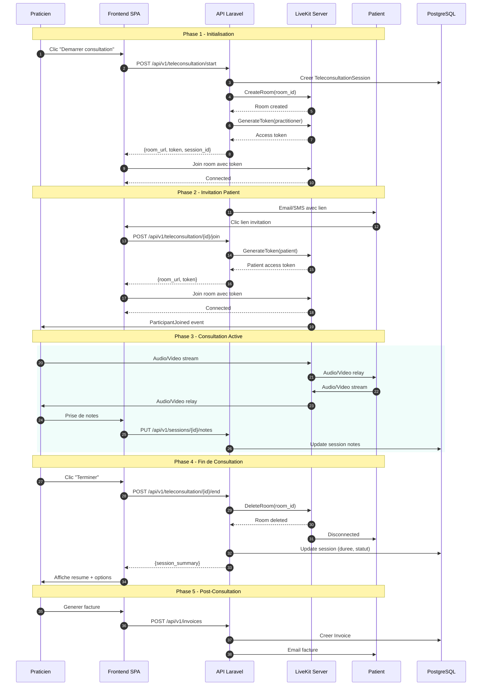

# Flux Teleconsultation - PratiConnect

## Description

Diagramme de sequence detaillant le flux complet d'une teleconsultation LiveKit, du demarrage par le praticien jusqu'a la fin de la session avec resume.

## Diagramme

## Phases Detaillees

### Phase 1: Initialisation
1. Le praticien demarre la consultation depuis son dashboard
2. L'API cree une session en base et une room LiveKit
3. Un token d'acces est genere pour le praticien
4. Le praticien rejoint la room video

### Phase 2: Invitation Patient
5. Le patient recoit un lien par email/SMS
6. En cliquant, il demande un token d'acces
7. L'API genere un token patient avec permissions limitees
8. Le patient rejoint la room
9. Le praticien est notifie de l'arrivee

### Phase 3: Consultation Active
- Streaming audio/video bidirectionnel via LiveKit
- Le praticien peut prendre des notes en temps reel
- Les notes sont sauvegardees periodiquement

### Phase 4: Fin de Consultation
- Le praticien termine la session
- La room LiveKit est supprimee
- La duree est calculee et enregistree
- Le patient est deconnecte proprement

### Phase 5: Post-Consultation
- Options: generer facture, envoyer questionnaire
- Resume de la session disponible

## Endpoints API

| Endpoint | Methode | Description |
|----------|---------|-------------|
| `/api/v1/teleconsultation/start` | POST | Demarre une nouvelle session |
| `/api/v1/teleconsultation/{id}/join` | POST | Genere token pour rejoindre |
| `/api/v1/teleconsultation/{id}/end` | POST | Termine la session |
| `/api/v1/teleconsultation/{id}` | GET | Recupere les details |

## Tokens LiveKit

| Role | Permissions |
|------|-------------|
| Praticien | canPublish, canSubscribe, canPublishData, roomAdmin |
| Patient | canPublish, canSubscribe |

## Gestion des Erreurs

| Erreur | Gestion |
|--------|---------|
| Room expiration | Auto-cleanup apres 2h sans activite |
| Deconnexion reseau | Reconnexion automatique (3 tentatives) |
| Token expire | Refresh automatique cote client |
| Patient absent | Timeout 15min, notification praticien |

## Usage

- Document cible: `/docs/public/tutorials/teleconsultation.md`
- Reference: Guide teleconsultation praticien et patient

## Notes

- LiveKit est self-hosted sur infrastructure PratiConnect
- Les streams video ne transitent pas par l'API Laravel (direct peer-to-peer via LiveKit)
- Les enregistrements de session sont optionnels et necessitent consentement
- Conformite HDS pour les donnees de sante
