# WebSocket Events - PratiConnect

## Description

Structure des canaux WebSocket (Laravel Broadcasting via Pusher/Soketi) et mapping des events temps reel pour les notifications et mises a jour live.

## Diagramme

```mermaid
flowchart TD
    subgraph Server["Laravel Backend"]
        EV["Event Dispatcher"]
        BC["Broadcasting"]
    end

    subgraph Channels["Canaux WebSocket"]
        direction TB
        PC["private-practitioner.{id}<br/><i>Canal praticien</i>"]
        PT["private-patient.{id}<br/><i>Canal patient</i>"]
        TN["private-tenant.{id}<br/><i>Canal organisation</i>"]
        SE["private-session.{id}<br/><i>Canal seance</i>"]
        TC["presence-teleconsultation.{id}<br/><i>Canal video</i>"]
    end

    subgraph PractitionerEvents["Events Praticien"]
        E1["AppointmentCreated"]
        E2["AppointmentUpdated"]
        E3["AppointmentCancelled"]
        E4["PaymentReceived"]
        E5["QuestionnaireCompleted"]
        E6["DocumentSigned"]
        E7["PatientMessage"]
    end

    subgraph PatientEvents["Events Patient"]
        E8["AppointmentReminder"]
        E9["QuestionnaireReceived"]
        E10["InvoiceReceived"]
        E11["DocumentToSign"]
        E12["TeleconsultationInvite"]
    end

    subgraph SessionEvents["Events Seance"]
        E13["SessionStarted"]
        E14["SessionUpdated"]
        E15["NotesSaved"]
        E16["SessionCompleted"]
    end

    subgraph TeleconsultationEvents["Events Teleconsultation"]
        E17["ParticipantJoined"]
        E18["ParticipantLeft"]
        E19["RecordingStarted"]
        E20["SessionEnding"]
    end

    EV --> BC --> Channels

    PC --> E1
    PC --> E2
    PC --> E3
    PC --> E4
    PC --> E5
    PC --> E6
    PC --> E7

    PT --> E8
    PT --> E9
    PT --> E10
    PT --> E11
    PT --> E12

    SE --> E13
    SE --> E14
    SE --> E15
    SE --> E16

    TC --> E17
    TC --> E18
    TC --> E19
    TC --> E20

    style EV fill:#6366f1,color:#fff
    style BC fill:#8b5cf6,color:#fff
    style PC fill:#0d9488,color:#fff
    style PT fill:#14b8a6,color:#fff
    style TN fill:#2dd4bf,color:#111827
    style SE fill:#f59e0b,color:#fff
    style TC fill:#ef4444,color:#fff
```



## Canaux

### private-practitioner.{id}

Canal prive pour chaque praticien. Authentification via Sanctum.

```typescript
// Frontend subscription
const channel = echo.private(`practitioner.${practitionerId}`);

channel.listen('AppointmentCreated', (e: AppointmentEvent) => {
  toast.success(`Nouveau RDV: ${e.patient.name}`);
  queryClient.invalidateQueries(['appointments']);
});
```

### private-patient.{id}

Canal prive pour chaque patient. Authentification via token portail.

```typescript
const channel = echo.private(`patient.${patientId}`);

channel.listen('QuestionnaireReceived', (e: QuestionnaireEvent) => {
  toast.info('Nouveau questionnaire a completer');
});
```

### private-session.{id}

Canal temporaire pour une seance en cours. Actif uniquement pendant la seance.

```typescript
const channel = echo.private(`session.${sessionId}`);

channel.listen('NotesSaved', (e: NotesEvent) => {
  // Sync confirmation
});
```

### presence-teleconsultation.{id}

Canal de presence pour teleconsultation. Permet de voir qui est present.

```typescript
const channel = echo.join(`teleconsultation.${teleconsultationId}`)
  .here((users) => {
    // Liste des participants actuels
  })
  .joining((user) => {
    toast.info(`${user.name} a rejoint`);
  })
  .leaving((user) => {
    toast.info(`${user.name} a quitte`);
  });
```

## Events Detail

### Events Praticien

| Event | Payload | Declencheur |
|-------|---------|-------------|
| `AppointmentCreated` | `{appointment, patient}` | Patient reserve un RDV |
| `AppointmentUpdated` | `{appointment, changes}` | Modification RDV |
| `AppointmentCancelled` | `{appointment, reason}` | Annulation |
| `PaymentReceived` | `{invoice, amount, method}` | Webhook paiement |
| `QuestionnaireCompleted` | `{questionnaire, patient, score}` | Patient repond |
| `DocumentSigned` | `{document, patient}` | Signature eIDAS completee |
| `PatientMessage` | `{message, patient}` | Message via portail |

### Events Patient

| Event | Payload | Declencheur |
|-------|---------|-------------|
| `AppointmentReminder` | `{appointment, type}` | Cron J-1 ou H-2 |
| `QuestionnaireReceived` | `{questionnaire, deadline}` | Praticien envoie |
| `InvoiceReceived` | `{invoice, payment_url}` | Facture envoyee |
| `DocumentToSign` | `{document, signature_url}` | Document a signer |
| `TeleconsultationInvite` | `{teleconsultation, join_url}` | Invitation video |

### Events Session

| Event | Payload | Declencheur |
|-------|---------|-------------|
| `SessionStarted` | `{session, patient}` | Debut seance |
| `SessionUpdated` | `{session, field, value}` | Modification live |
| `NotesSaved` | `{session, timestamp}` | Auto-save notes |
| `SessionCompleted` | `{session, summary}` | Fin seance |

### Events Teleconsultation

| Event | Payload | Declencheur |
|-------|---------|-------------|
| `ParticipantJoined` | `{user, role}` | Connexion room |
| `ParticipantLeft` | `{user, reason}` | Deconnexion |
| `RecordingStarted` | `{recording_id}` | Demarrage enregistrement |
| `SessionEnding` | `{remaining_minutes}` | Alerte fin proche |

## Configuration Laravel

```php
// config/broadcasting.php
'connections' => [
    'pusher' => [
        'driver' => 'pusher',
        'key' => env('BROADCAST_APP_KEY'),
        'secret' => env('BROADCAST_APP_SECRET'),
        'app_id' => env('BROADCAST_APP_ID'),
        'options' => [
            'host' => env('PUSHER_HOST', 'soketi.praticonnect.com'),
            'port' => env('PUSHER_PORT', 6001),
            'scheme' => env('PUSHER_SCHEME', 'https'),
            'encrypted' => true,
        ],
    ],
],
```

## Frontend Integration

```typescript
// lib/echo.ts
import Echo from 'laravel-echo';
import Pusher from 'pusher-js';

window.Pusher = Pusher;

export const echo = new Echo({
  broadcaster: 'pusher',
  key: import.meta.env.VITE_BROADCAST_APP_KEY,
  wsHost: import.meta.env.VITE_PUSHER_HOST,
  wsPort: import.meta.env.VITE_PUSHER_PORT,
  wssPort: import.meta.env.VITE_PUSHER_PORT,
  forceTLS: true,
  disableStats: true,
  enabledTransports: ['ws', 'wss'],
  authorizer: (channel) => ({
    authorize: (socketId, callback) => {
      api.post('/broadcasting/auth', {
        socket_id: socketId,
        channel_name: channel.name,
      })
      .then(response => callback(null, response.data))
      .catch(error => callback(error, null));
    },
  }),
});
```

## Usage

- Document cible: `/docs/websocket-events.md`
- Reference: Guide integration temps reel

## Notes

- Soketi (self-hosted) est utilise en production comme alternative Pusher
- Les canaux `private-*` necessitent authentification
- Les canaux `presence-*` permettent de voir les participants
- Rate limiting applique: 100 events/minute par canal
- Les events sont loggues pour debugging (desactivable en production)
