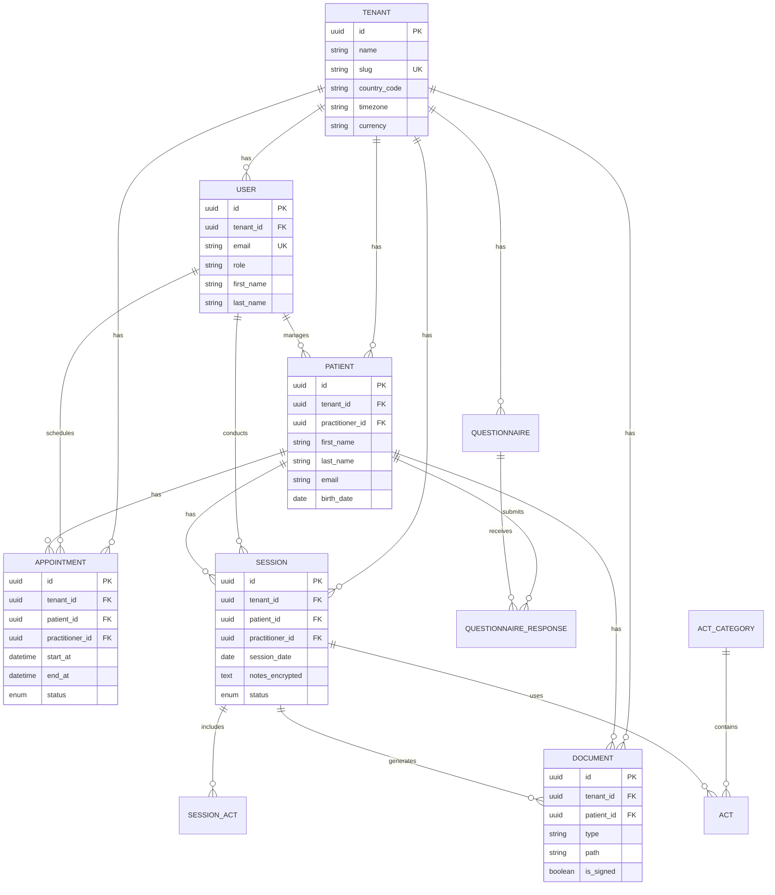
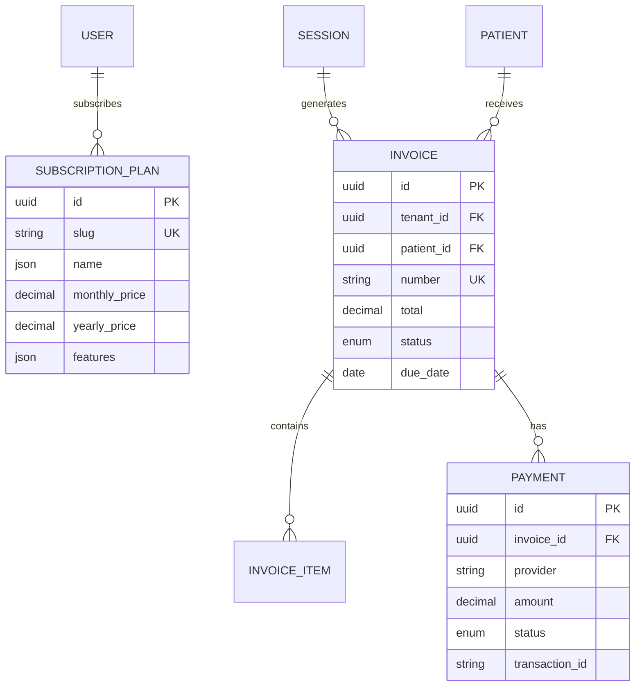
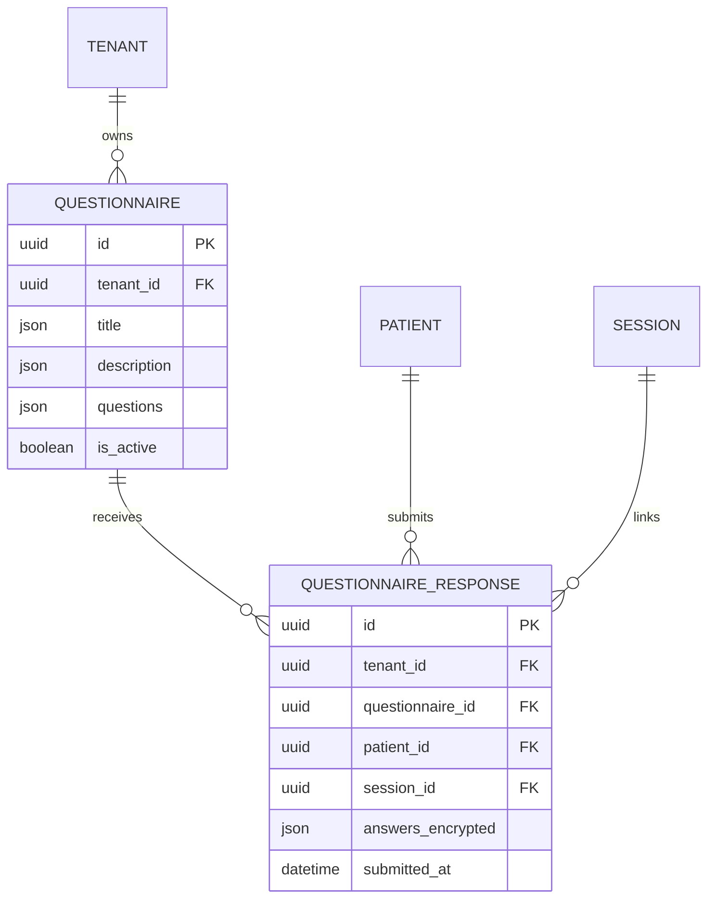

# Database Schema - PratiConnect

> Documentation du schema de base de donnees PostgreSQL.

---

## Table des matieres

1. [Vue d'ensemble](#1-vue-densemble)
2. [Diagramme ER](#2-diagramme-er)
3. [Tables principales](#3-tables-principales)
4. [Multi-tenancy et RLS](#4-multi-tenancy-et-rls)
5. [Relations cles](#5-relations-cles)
6. [Conventions](#6-conventions)

---

## 1. Vue d'ensemble

### Chiffres cles

| Element | Nombre |
|---------|--------|
| Tables | 149 |
| Extensions PostgreSQL | 4 |
| Policies RLS | ~50 |
| Index | ~200 |

### Extensions PostgreSQL

```sql
CREATE EXTENSION IF NOT EXISTS "uuid-ossp";   -- UUIDs
CREATE EXTENSION IF NOT EXISTS "pgvector";     -- Embeddings IA
CREATE EXTENSION IF NOT EXISTS "unaccent";     -- Recherche sans accents
CREATE EXTENSION IF NOT EXISTS "pg_trgm";      -- Recherche fuzzy
```

---

## 2. Diagramme ER

### 2.1 Modele principal (simplifie)



### 2.2 Module facturation



### 2.3 Module questionnaires



---

## 3. Tables principales

### 3.1 tenants

Cabinet/pratique independant. Racine de l'isolation multi-tenant.

```sql
CREATE TABLE tenants (
    id UUID PRIMARY KEY DEFAULT uuid_generate_v4(),
    name VARCHAR(255) NOT NULL,
    slug VARCHAR(255) UNIQUE NOT NULL,
    custom_domain VARCHAR(255),

    -- Localisation
    country_code CHAR(2) NOT NULL,
    timezone VARCHAR(100) DEFAULT 'Europe/Paris',
    currency CHAR(3) DEFAULT 'EUR',

    -- Storage
    storage_used_bytes BIGINT DEFAULT 0,
    storage_limit_bytes BIGINT DEFAULT 21474836480, -- 20GB

    -- SMS Credits
    sms_credits INTEGER DEFAULT 0,
    sms_option_active BOOLEAN DEFAULT FALSE,

    -- Settings (JSONB)
    settings JSONB DEFAULT '{}',

    -- Timestamps
    created_at TIMESTAMP DEFAULT CURRENT_TIMESTAMP,
    updated_at TIMESTAMP DEFAULT CURRENT_TIMESTAMP,
    deleted_at TIMESTAMP
);

-- Index
CREATE INDEX idx_tenants_slug ON tenants(slug);
```

### 3.2 users

Utilisateurs du systeme (praticiens, secretaires).

```sql
CREATE TABLE users (
    id UUID PRIMARY KEY DEFAULT uuid_generate_v4(),
    tenant_id UUID NOT NULL REFERENCES tenants(id) ON DELETE CASCADE,

    -- Auth
    email VARCHAR(255) NOT NULL,
    password VARCHAR(255),
    email_verified_at TIMESTAMP,
    two_factor_enabled BOOLEAN DEFAULT FALSE,
    two_factor_secret VARCHAR(255),

    -- Role
    role VARCHAR(50) NOT NULL, -- practitioner, secretary

    -- Profile
    first_name VARCHAR(255) NOT NULL,
    last_name VARCHAR(255) NOT NULL,
    phone VARCHAR(50),
    avatar_url VARCHAR(500),
    locale VARCHAR(10) DEFAULT 'fr',

    -- Practitioner specific
    title VARCHAR(100),
    specialty VARCHAR(255),
    bio TEXT,
    public_profile_enabled BOOLEAN DEFAULT FALSE,
    booking_enabled BOOLEAN DEFAULT FALSE,

    -- Subscription (credits au niveau User)
    subscription_plan_id UUID REFERENCES subscription_plans(id),
    subscription_status VARCHAR(50) DEFAULT 'trial',
    trial_ends_at TIMESTAMP,
    signature_credits INTEGER DEFAULT 0,
    transcription_credits INTEGER DEFAULT 0,

    -- Stripe
    stripe_customer_id VARCHAR(255),

    -- Timestamps
    created_at TIMESTAMP DEFAULT CURRENT_TIMESTAMP,
    updated_at TIMESTAMP DEFAULT CURRENT_TIMESTAMP,
    deleted_at TIMESTAMP,

    UNIQUE(email, tenant_id)
);

-- RLS
ALTER TABLE users ENABLE ROW LEVEL SECURITY;
CREATE POLICY tenant_isolation ON users
    USING (tenant_id = current_setting('app.current_tenant', true)::uuid);
```

### 3.3 patients

Patients des praticiens.

```sql
CREATE TABLE patients (
    id UUID PRIMARY KEY DEFAULT uuid_generate_v4(),
    tenant_id UUID NOT NULL REFERENCES tenants(id) ON DELETE CASCADE,
    practitioner_id UUID NOT NULL REFERENCES users(id),
    user_id UUID REFERENCES users(id), -- Compte patient optionnel

    -- Identity
    first_name VARCHAR(255) NOT NULL,
    last_name VARCHAR(255) NOT NULL,
    email VARCHAR(255),
    phone VARCHAR(50),
    birth_date DATE,
    gender VARCHAR(20),

    -- Address
    address_line1 VARCHAR(255),
    address_line2 VARCHAR(255),
    city VARCHAR(100),
    postal_code VARCHAR(20),
    country VARCHAR(100),

    -- Medical (encrypted)
    medical_notes_encrypted TEXT,

    -- Tags & categorization
    tags JSONB DEFAULT '[]',

    -- Metadata
    source VARCHAR(100), -- manual, import, booking
    referral_source VARCHAR(255),

    -- Therapeutic objectives
    objectives JSONB DEFAULT '[]',

    -- Stripe
    stripe_customer_id VARCHAR(255),

    -- RGPD
    consent_given_at TIMESTAMP,
    data_retention_until TIMESTAMP,
    anonymized_at TIMESTAMP,

    -- Stats (denormalized)
    sessions_count INTEGER DEFAULT 0,
    last_session_at TIMESTAMP,
    total_spent DECIMAL(10,2) DEFAULT 0,

    -- Timestamps
    created_at TIMESTAMP DEFAULT CURRENT_TIMESTAMP,
    updated_at TIMESTAMP DEFAULT CURRENT_TIMESTAMP,
    deleted_at TIMESTAMP
);

-- Index
CREATE INDEX idx_patients_tenant ON patients(tenant_id);
CREATE INDEX idx_patients_practitioner ON patients(practitioner_id);
CREATE INDEX idx_patients_email ON patients(email);

-- Full-text search
CREATE INDEX idx_patients_search ON patients
    USING GIN (to_tsvector('french', first_name || ' ' || last_name || ' ' || COALESCE(email, '')));

-- RLS
ALTER TABLE patients ENABLE ROW LEVEL SECURITY;
CREATE POLICY tenant_isolation ON patients
    USING (tenant_id = current_setting('app.current_tenant', true)::uuid);
```

### 3.4 sessions

Sessions de soin (consultations).

```sql
CREATE TABLE sessions (
    id UUID PRIMARY KEY DEFAULT uuid_generate_v4(),
    tenant_id UUID NOT NULL REFERENCES tenants(id) ON DELETE CASCADE,
    patient_id UUID NOT NULL REFERENCES patients(id),
    practitioner_id UUID NOT NULL REFERENCES users(id),
    appointment_id UUID REFERENCES appointments(id),

    -- Timing
    session_date DATE NOT NULL,
    started_at TIMESTAMP,
    ended_at TIMESTAMP,
    duration_minutes INTEGER,

    -- Status
    status VARCHAR(50) DEFAULT 'draft', -- draft, in_progress, completed, cancelled

    -- Notes (encrypted)
    notes_encrypted TEXT,
    private_notes_encrypted TEXT,

    -- Vitals
    vital_signs JSONB DEFAULT '{}',
    biological_measures JSONB DEFAULT '{}',

    -- Billing
    invoice_id UUID REFERENCES invoices(id),
    total_amount DECIMAL(10,2),
    payment_status VARCHAR(50) DEFAULT 'pending',

    -- Teleconsultation
    is_teleconsultation BOOLEAN DEFAULT FALSE,
    livekit_room_name VARCHAR(255),

    -- Encryption metadata
    encryption_key_id VARCHAR(255),
    encryption_version INTEGER DEFAULT 1,

    -- Timestamps
    created_at TIMESTAMP DEFAULT CURRENT_TIMESTAMP,
    updated_at TIMESTAMP DEFAULT CURRENT_TIMESTAMP,
    deleted_at TIMESTAMP
);

-- RLS
ALTER TABLE sessions ENABLE ROW LEVEL SECURITY;
CREATE POLICY tenant_isolation ON sessions
    USING (tenant_id = current_setting('app.current_tenant', true)::uuid);
```

### 3.5 appointments

Rendez-vous (agenda).

```sql
CREATE TABLE appointments (
    id UUID PRIMARY KEY DEFAULT uuid_generate_v4(),
    tenant_id UUID NOT NULL REFERENCES tenants(id) ON DELETE CASCADE,
    patient_id UUID REFERENCES patients(id),
    practitioner_id UUID NOT NULL REFERENCES users(id),
    act_id UUID REFERENCES acts(id),

    -- Timing
    start_at TIMESTAMP NOT NULL,
    end_at TIMESTAMP NOT NULL,

    -- Status
    status VARCHAR(50) DEFAULT 'scheduled', -- scheduled, confirmed, cancelled, completed, no_show

    -- Details
    title VARCHAR(255),
    notes TEXT,
    color VARCHAR(20),

    -- Booking
    booking_source VARCHAR(50), -- manual, online, recurring
    confirmed_at TIMESTAMP,
    cancelled_at TIMESTAMP,
    cancellation_reason TEXT,

    -- Google Calendar sync
    google_event_id VARCHAR(255),
    google_calendar_id VARCHAR(255),

    -- Reminders
    reminder_sent_at TIMESTAMP,

    -- Teleconsultation
    is_teleconsultation BOOLEAN DEFAULT FALSE,

    -- Timestamps
    created_at TIMESTAMP DEFAULT CURRENT_TIMESTAMP,
    updated_at TIMESTAMP DEFAULT CURRENT_TIMESTAMP,
    deleted_at TIMESTAMP
);

-- RLS
ALTER TABLE appointments ENABLE ROW LEVEL SECURITY;
CREATE POLICY tenant_isolation ON appointments
    USING (tenant_id = current_setting('app.current_tenant', true)::uuid);
```

### 3.6 documents

Documents (fichiers patients, factures, templates).

```sql
CREATE TABLE documents (
    id UUID PRIMARY KEY DEFAULT uuid_generate_v4(),
    tenant_id UUID NOT NULL REFERENCES tenants(id) ON DELETE CASCADE,
    patient_id UUID REFERENCES patients(id),
    session_id UUID REFERENCES sessions(id),
    uploaded_by_id UUID REFERENCES users(id),

    -- Type
    type VARCHAR(50) NOT NULL, -- medical_report, invoice, prescription, consent, other
    category_id UUID REFERENCES document_categories(id),

    -- File
    filename VARCHAR(255) NOT NULL,
    original_filename VARCHAR(255),
    mime_type VARCHAR(100),
    size_bytes BIGINT,
    path VARCHAR(500) NOT NULL,

    -- Metadata
    title VARCHAR(255),
    description TEXT,
    language VARCHAR(10) DEFAULT 'fr',
    tags JSONB DEFAULT '[]',

    -- Signature
    is_signed BOOLEAN DEFAULT FALSE,
    signed_at TIMESTAMP,
    signature_request_id UUID REFERENCES signature_requests(id),

    -- Encryption
    is_encrypted BOOLEAN DEFAULT FALSE,
    encryption_key_id VARCHAR(255),

    -- OCR & RAG
    ocr_extracted_text TEXT,
    ocr_processed_at TIMESTAMP,
    embedding vector(1536), -- pgvector

    -- Timestamps
    created_at TIMESTAMP DEFAULT CURRENT_TIMESTAMP,
    updated_at TIMESTAMP DEFAULT CURRENT_TIMESTAMP,
    deleted_at TIMESTAMP
);

-- RLS
ALTER TABLE documents ENABLE ROW LEVEL SECURITY;
CREATE POLICY tenant_isolation ON documents
    USING (tenant_id = current_setting('app.current_tenant', true)::uuid);
```

---

## 4. Multi-tenancy et RLS

### 4.1 Principe

Chaque table metier contient une colonne `tenant_id` et une politique RLS :

```sql
-- Activer RLS
ALTER TABLE {table_name} ENABLE ROW LEVEL SECURITY;

-- Politique d'isolation
CREATE POLICY tenant_isolation ON {table_name}
    USING (tenant_id = current_setting('app.current_tenant', true)::uuid);
```

### 4.2 Contexte tenant

Le middleware Laravel definit le contexte avant chaque requete :

```php
DB::statement("SET app.current_tenant = '{$user->tenant_id}'");
```

### 4.3 Tables sans RLS

| Table | Raison |
|-------|--------|
| `tenants` | Racine de l'arbre |
| `subscription_plans` | Donnees globales |
| `subscription_options` | Donnees globales |
| `specialties` | Reference globale |
| `admin_users` | Administrateurs plateforme |
| `admin_settings` | Configuration globale |
| `newsletter_subscribers` | Hors tenant |
| `webhook_events` | Logs externes |

### 4.4 Bypass RLS (admin)

Pour les operations d'administration :

```sql
SET ROLE postgres;  -- Superuser bypass RLS
-- ou
ALTER POLICY tenant_isolation ON users USING (true);  -- Temporaire
```

---

## 5. Relations cles

### 5.1 Hierarchie principale

```
Tenant
  └── User (practitioner)
        └── Patient
              ├── Session
              │     ├── SessionAct
              │     └── Document
              ├── Appointment
              ├── Document
              └── QuestionnaireResponse
```

### 5.2 Clefs etrangeres critiques

| Table source | Colonne | Table cible | On Delete |
|--------------|---------|-------------|-----------|
| users | tenant_id | tenants | CASCADE |
| patients | tenant_id | tenants | CASCADE |
| patients | practitioner_id | users | NO ACTION |
| sessions | patient_id | patients | NO ACTION |
| sessions | practitioner_id | users | NO ACTION |
| appointments | patient_id | patients | NO ACTION |
| documents | patient_id | patients | NO ACTION |

### 5.3 Relations polymorphiques

Certaines tables utilisent des relations polymorphiques :

```sql
-- audit_logs
auditable_type VARCHAR(255)  -- 'App\Models\Patient', 'App\Models\Session'
auditable_id UUID

-- notifications
notifiable_type VARCHAR(255)
notifiable_id UUID
```

---

## 6. Conventions

### 6.1 Nommage

| Element | Convention | Exemple |
|---------|------------|---------|
| Tables | snake_case pluriel | `patients`, `session_acts` |
| Colonnes | snake_case | `first_name`, `created_at` |
| Primary key | `id` (UUID) | `id UUID PRIMARY KEY` |
| Foreign key | `{table}_id` | `patient_id`, `tenant_id` |
| Timestamps | `*_at` | `created_at`, `deleted_at` |
| Booleans | `is_*` ou `has_*` | `is_active`, `has_2fa` |
| JSONB | nom explicite | `settings`, `metadata` |

### 6.2 Types de donnees

| Usage | Type PostgreSQL |
|-------|-----------------|
| Identifiant | `UUID` |
| Texte court | `VARCHAR(n)` |
| Texte long | `TEXT` |
| Entier | `INTEGER`, `BIGINT` |
| Decimal | `DECIMAL(10,2)` |
| Boolean | `BOOLEAN` |
| Date | `DATE` |
| Datetime | `TIMESTAMP` |
| JSON | `JSONB` |
| Enum | `VARCHAR(50)` + check |
| Embedding IA | `vector(1536)` |

### 6.3 Index recommandes

```sql
-- Toujours indexer tenant_id
CREATE INDEX idx_{table}_tenant ON {table}(tenant_id);

-- Colonnes de recherche frequente
CREATE INDEX idx_patients_email ON patients(email);
CREATE INDEX idx_appointments_start ON appointments(start_at);

-- Full-text search
CREATE INDEX idx_patients_search ON patients
    USING GIN (to_tsvector('french', first_name || ' ' || last_name));

-- JSONB
CREATE INDEX idx_users_settings ON users USING GIN (settings);
```

### 6.4 Migrations conditionnelles

Toujours verifier avant de creer :

```php
if (!Schema::hasTable('my_table')) {
    Schema::create('my_table', function (Blueprint $table) {
        // ...
    });
}

if (!Schema::hasColumn('my_table', 'new_column')) {
    Schema::table('my_table', function (Blueprint $table) {
        $table->string('new_column')->nullable();
    });
}
```

---

## Voir aussi

- [Architecture Overview](/docs/architecture/OVERVIEW.md) - Vue d'ensemble
- [Backend Architecture](/docs/generated/01-BACKEND-ARCHITECTURE.md) - Details backend
- [API Reference](/docs/generated/02-API-REFERENCE.md) - Endpoints API

---

*Document mis a jour : 2026-02-05*
