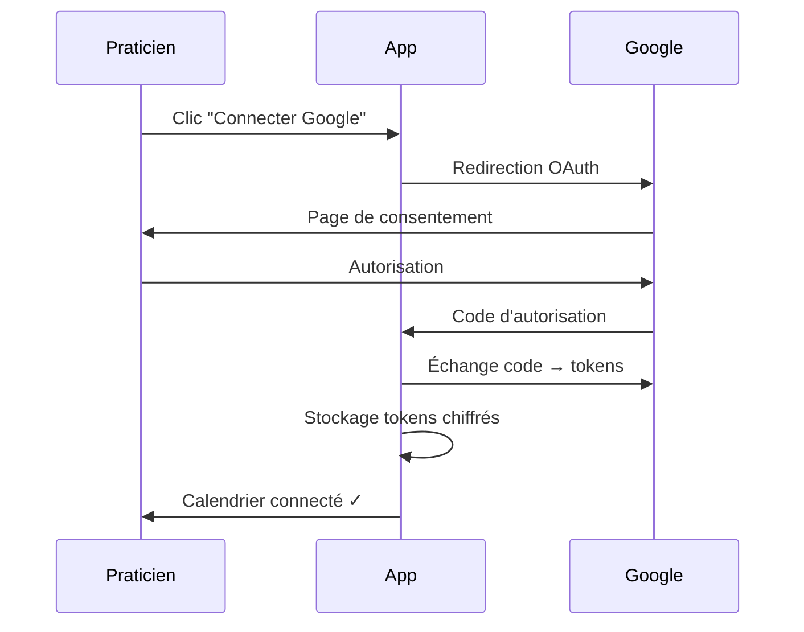

# 📅 Module Agenda & Rendez-vous

> Planification intelligente avec synchronisation Google Calendar et rappels automatiques

---

## 📋 Vue d'Ensemble

Le module Agenda permet aux praticiens de gérer leurs rendez-vous de manière fluide avec une synchronisation bidirectionnelle Google Calendar, des rappels automatiques par email/SMS, et un système de réservation publique.

### Fonctionnalités Principales
- ✅ Calendrier interactif (jour/semaine/mois)
- ✅ Synchronisation Google Calendar bidirectionnelle
- ✅ Création rapide de rendez-vous
- ✅ Gestion des disponibilités
- ✅ Périodes de fermeture
- ✅ Rappels automatiques (email + SMS)
- ✅ Booking public pour les patients

---

## 🗄️ Modèle de Données

### Table `appointments`

| Champ | Type | Description |
|-------|------|-------------|
| `id` | UUID | Identifiant unique |
| `tenant_id` | UUID (FK) | Isolation multi-tenant |
| `practitioner_id` | UUID (FK) | Praticien concerné |
| `patient_id` | UUID (FK, nullable) | Patient (si applicable) |
| `session_id` | UUID (FK, nullable) | Session liée |
| `starts_at` | timestamp | Début du RDV |
| `ends_at` | timestamp | Fin du RDV |
| `appointment_type` | enum | session/blocked/personal |
| `title` | string | Titre du RDV |
| `notes` | text | Notes internes |
| `status` | enum | pending/confirmed/cancelled |
| `google_calendar_event_id` | string | ID événement Google |
| `reminder_email_sent_at` | timestamp | Rappel email envoyé |
| `reminder_sms_sent_at` | timestamp | Rappel SMS envoyé |

### Table `availability_rules`

| Champ | Type | Description |
|-------|------|-------------|
| `id` | UUID | Identifiant unique |
| `practitioner_id` | UUID (FK) | Praticien |
| `day_of_week` | integer | 0-6 (Dim-Sam) |
| `start_time` | time | Heure début |
| `end_time` | time | Heure fin |
| `is_active` | boolean | Règle active |

### Table `closure_periods`

| Champ | Type | Description |
|-------|------|-------------|
| `id` | UUID | Identifiant unique |
| `practitioner_id` | UUID (FK) | Praticien |
| `starts_at` | datetime | Début fermeture |
| `ends_at` | datetime | Fin fermeture |
| `reason` | string | Motif (vacances, formation...) |

### Table `calendar_settings`

| Champ | Type | Description |
|-------|------|-------------|
| `user_id` | UUID (FK) | Utilisateur |
| `google_calendar_id` | string | ID calendrier Google |
| `google_access_token` | text | Token OAuth (chiffré) |
| `google_refresh_token` | text | Refresh token (chiffré) |
| `sync_enabled` | boolean | Sync activée |
| `last_sync_at` | timestamp | Dernière sync |

---

## 🔌 API Endpoints

### Vues Calendrier

```http
GET    /api/v1/calendar/day       # Vue jour
GET    /api/v1/calendar/week      # Vue semaine
GET    /api/v1/calendar/month     # Vue mois
GET    /api/v1/calendar/available-slots  # Créneaux disponibles
```

### Rendez-vous

```http
GET    /api/v1/appointments                    # Liste
POST   /api/v1/appointments                    # Créer RDV
GET    /api/v1/appointments/{id}               # Détail
PUT    /api/v1/appointments/{id}               # Modifier
DELETE /api/v1/appointments/{id}               # Supprimer

POST   /api/v1/appointments/{id}/confirm       # Confirmer
POST   /api/v1/appointments/{id}/cancel        # Annuler
POST   /api/v1/appointments/{id}/reschedule    # Reprogrammer
POST   /api/v1/appointments/{id}/mark-no-show  # No-show
POST   /api/v1/appointments/{id}/send-reminder-email  # Rappel email
POST   /api/v1/appointments/{id}/send-reminder-sms    # Rappel SMS
```

### Disponibilités

```http
GET    /api/v1/availability                    # Règles de disponibilité
POST   /api/v1/availability                    # Créer règle
PUT    /api/v1/availability/{id}               # Modifier
DELETE /api/v1/availability/{id}               # Supprimer
```

### Fermetures

```http
GET    /api/v1/closure-periods                 # Périodes de fermeture
POST   /api/v1/closure-periods                 # Créer fermeture
PUT    /api/v1/closure-periods/{id}            # Modifier
DELETE /api/v1/closure-periods/{id}            # Supprimer
```

### Google Calendar

```http
POST   /api/v1/calendar/google/connect         # Connexion OAuth
POST   /api/v1/calendar/google/disconnect      # Déconnexion
POST   /api/v1/calendar/google/sync            # Synchroniser
GET    /api/v1/calendar/google/status          # Statut sync
```

---

## 🖥️ Interface Utilisateur

### Vue Calendrier

**Composant** : `CalendarPage.tsx`

Fonctionnalités :
- Vue jour/semaine/mois avec navigation
- Drag & drop pour déplacer les RDV
- Redimensionnement pour modifier la durée
- Code couleur par type de RDV
- Indicateur de synchronisation Google
- Filtres par type et statut

> 🎨 **Illustration** : Calendrier semaine avec créneaux colorés (bleu=consultation, gris=bloqué, vert=confirmé), bouton sync Google visible

---

### Modal Création RDV

**Composant** : `AppointmentFormModal.tsx`

Champs :
- Patient (avec recherche auto-complete)
- Type (Consultation, Personnel, Bloqué)
- Date et horaires
- Durée (avec suggestions selon acte)
- Notes internes
- Notification automatique

> 🎨 **Illustration** : Modal avec sélecteur patient, date picker, sélecteur d'heure avec créneaux disponibles en vert

---

### Paramètres Calendrier

**Composant** : `CalendarSettings.tsx`

Sections :
- **Disponibilités** : Grille semaine avec plages horaires
- **Google Calendar** : Connexion et paramètres sync
- **Rappels** : Configuration email/SMS
- **Fermetures** : Liste des périodes fermées

> 🎨 **Illustration** : Grille de disponibilités avec cellules cliquables, toggle Google Calendar connecté

---

## ⚙️ Services Backend

### AppointmentService

```php
class AppointmentService
{
    // Création avec vérification de disponibilité
    public function create(array $data): Appointment;

    // Reprogrammation avec notification
    public function reschedule(Appointment $appointment, Carbon $newDate): Appointment;

    // Annulation avec motif
    public function cancel(Appointment $appointment, string $reason): Appointment;

    // Vérification de conflit
    public function hasConflict(Practitioner $practitioner, Carbon $start, Carbon $end): bool;
}
```

### GoogleCalendarService

```php
class GoogleCalendarService
{
    // Flux OAuth2
    public function getAuthUrl(User $user): string;
    public function connect(User $user, string $code): void;

    // Création d'événement
    public function createEvent(Appointment $appointment): string;
    public function updateEvent(Appointment $appointment): void;
    public function deleteEvent(Appointment $appointment): void;

    // Synchronisation
    public function syncAppointmentsToGoogle(User $user): void;
    public function syncFromGoogle(User $user): void;
}
```

### AvailabilityService

```php
class AvailabilityService
{
    // Récupérer les créneaux disponibles
    public function getAvailableSlots(
        User $practitioner,
        Carbon $date,
        int $durationMinutes
    ): Collection;

    // Vérifier si créneau disponible
    public function isSlotAvailable(
        User $practitioner,
        Carbon $start,
        Carbon $end
    ): bool;
}
```

---

## 📨 Rappels Automatiques

### Configuration

| Type | Délai | Méthode |
|------|-------|---------|
| Email confirmation | Immédiat | Toujours |
| Email rappel | 24h avant | Si activé |
| SMS rappel | 24h avant | Si activé + crédits |

### Templates de Messages

**Email de rappel** :
```
Objet: Rappel - Votre RDV demain à {heure}

Bonjour {patient.first_name},

Nous vous rappelons votre rendez-vous :
📅 {date} à {heure}
👤 {praticien.name}
📍 {adresse}

Pour annuler ou reporter, contactez-nous.
```

**SMS de rappel** :
```
RDV demain {heure} avec {praticien.name}.
Annuler: {lien_annulation}
```

---

## 🔗 Intégration Google Calendar

### Flux OAuth2



### Synchronisation Bidirectionnelle

| Direction | Événements |
|-----------|------------|
| App → Google | Création, modification, suppression RDV |
| Google → App | Import des événements existants |

### Gestion des Conflits
- Priorité aux données PratiConnect
- Création d'événement Google si absent
- Mise à jour si `google_event_id` existe

---

## 📱 Booking Public

### Endpoints Publics

```http
GET    /api/v1/availability/{practitioner}     # Disponibilités publiques
POST   /api/v1/booking/{practitioner}          # Créer RDV public
```

### Flux de Réservation

1. Patient visite le profil public
2. Sélection du type de consultation
3. Choix de la date
4. Sélection du créneau disponible
5. Saisie des informations (ou connexion)
6. Confirmation et paiement (si requis)

> 🎨 **Illustration** : Widget booking avec calendrier mini, créneaux disponibles, et formulaire patient

---

## 🎨 Propositions d'Illustrations

### 1. Vue Calendrier Semaine
```
┌─────────────────────────────────────────────────────────────┐
│ ◀ Semaine du 20 Jan 2026 ▶    [Jour] [Semaine] [Mois]  🔄  │
├─────────────────────────────────────────────────────────────┤
│      │ Lun 20 │ Mar 21 │ Mer 22 │ Jeu 23 │ Ven 24 │ Sam 25│
├──────┼────────┼────────┼────────┼────────┼────────┼───────┤
│ 8:00 │        │        │        │        │        │░░░░░░░│
│ 9:00 │┌──────┐│        │┌──────┐│        │┌──────┐│░░░░░░░│
│10:00 ││ Marie ││        ││ Jean ││        ││ Paul ││░░░░░░░│
│11:00 │└──────┘│        │└──────┘│        │└──────┘│░░░░░░░│
│12:00 │░░░░░░░░│░░░░░░░░│░░░░░░░░│░░░░░░░░│░░░░░░░░│░░░░░░░│
│13:00 │░░░░░░░░│░░░░░░░░│░░░░░░░░│░░░░░░░░│░░░░░░░░│░░░░░░░│
│14:00 │        │┌──────┐│        │┌──────┐│        │       │
│15:00 │        ││Sophie││        ││Pierre││        │       │
│16:00 │        │└──────┘│        │└──────┘│        │       │
└──────┴────────┴────────┴────────┴────────┴────────┴───────┘
│ 🔵 Consultation  🟢 Confirmé  ⬜ Personnel  ░░ Indisponible │
└─────────────────────────────────────────────────────────────┘
```

### 2. Paramètres de Disponibilité
```
┌─────────────────────────────────────────────────────────────┐
│ ⚙️ Disponibilités hebdomadaires                             │
├─────────────────────────────────────────────────────────────┤
│        │ Matin (8h-12h) │ Après-midi (14h-18h) │           │
├────────┼────────────────┼──────────────────────┤           │
│ Lundi  │ ✅ 09:00-12:00 │ ✅ 14:00-18:00       │  [Éditer] │
│ Mardi  │ ✅ 09:00-12:00 │ ✅ 14:00-18:00       │  [Éditer] │
│ Mercredi│ ✅ 09:00-12:00 │ ❌ Fermé            │  [Éditer] │
│ Jeudi  │ ✅ 09:00-12:00 │ ✅ 14:00-18:00       │  [Éditer] │
│ Vendredi│ ✅ 09:00-12:00 │ ✅ 14:00-17:00      │  [Éditer] │
│ Samedi │ ✅ 09:00-12:00 │ ❌ Fermé            │  [Éditer] │
│ Dimanche│ ❌ Fermé       │ ❌ Fermé            │  [Éditer] │
└────────┴────────────────┴──────────────────────┴───────────┘
```

### 3. Widget Booking Public
```
┌─────────────────────────────────────────────────────────────┐
│             📅 Réserver un rendez-vous                      │
├─────────────────────────────────────────────────────────────┤
│ Type de consultation:                                       │
│ ┌─────────────────────────────────────────────────────────┐ │
│ │ ○ Première consultation (1h) - 80€                      │ │
│ │ ● Suivi (45min) - 60€                                   │ │
│ │ ○ Bilan annuel (1h30) - 100€                           │ │
│ └─────────────────────────────────────────────────────────┘ │
│                                                             │
│ Choisissez une date:                                        │
│ ┌─────────────────────────────────────────────────────────┐ │
│ │     ◀ Janvier 2026 ▶                                    │ │
│ │  Lu Ma Me Je Ve Sa Di                                   │ │
│ │        1  2  3  4  5                                    │ │
│ │   6  7  8  9 10 11 12                                   │ │
│ │  13 14 15 16 17 18 19                                   │ │
│ │  20[21]22 23 24 25 26  ← Sélectionné                    │ │
│ │  27 28 29 30 31                                         │ │
│ └─────────────────────────────────────────────────────────┘ │
│                                                             │
│ Créneaux disponibles le 21/01:                              │
│ ┌────────┐ ┌────────┐ ┌────────┐ ┌────────┐               │
│ │ 09:00  │ │ 10:00  │ │ 14:00  │ │ 15:00  │               │
│ └────────┘ └────────┘ └────────┘ └────────┘               │
│                                                             │
│              [ Continuer la réservation → ]                 │
└─────────────────────────────────────────────────────────────┘
```

---

## 📝 Notes d'Implémentation

### Gestion des Fuseaux Horaires
- Stockage en UTC dans la base
- Conversion selon `user.timezone`
- Affichage localisé côté frontend

### Gestion des Récurrences
- Rendez-vous récurrents via `recurrence_rule`
- Expansion à la volée pour l'affichage
- Modification "cette occurrence" ou "toutes"

### Notifications
- Jobs Laravel Queue pour l'envoi
- Retry automatique en cas d'échec
- Log des envois réussis/échoués

---

*Documentation générée pour PratiConnect v1.0*
