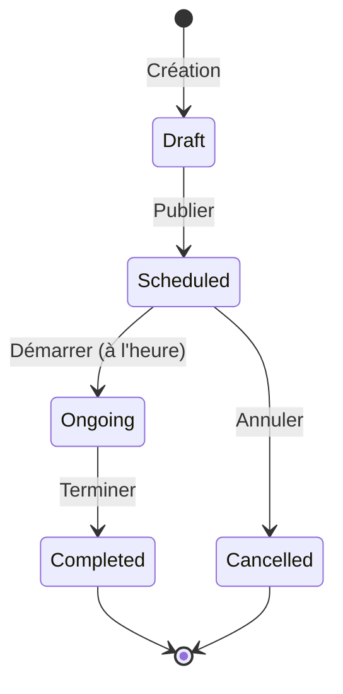
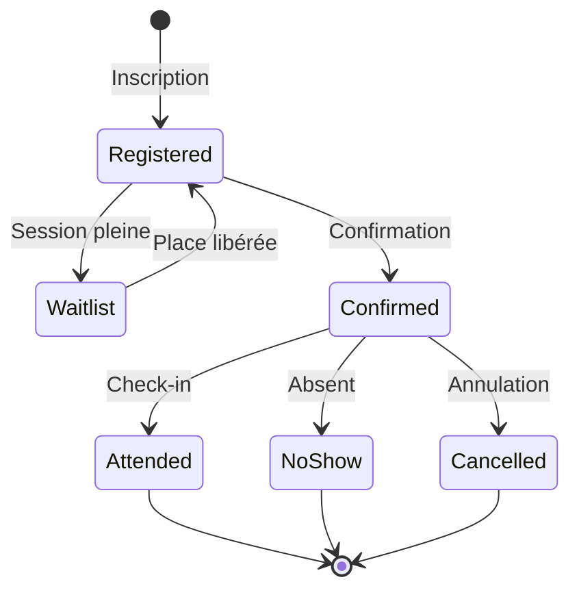

# 👥 Module Sessions Collectives

> Gestion des sessions de groupe avec participants multiples, inscriptions et téléconsultation

---

## 📋 Vue d'Ensemble

Le module Sessions Collectives permet aux praticiens d'organiser des ateliers, cours et sessions de groupe avec plusieurs participants. Il gère les inscriptions, listes d'attente, paiements groupés et téléconsultation vidéo.

### Fonctionnalités Principales
- ✅ Création de sessions récurrentes ou ponctuelles
- ✅ Gestion des participants et liste d'attente
- ✅ Salle d'attente virtuelle (waiting room)
- ✅ Téléconsultation vidéo multi-participants (LiveKit)
- ✅ Facturation par participant
- ✅ Accès portail patient pour inscriptions
- ✅ Notifications automatiques (rappels, confirmations)

---

## 🗄️ Modèle de Données

### Table `collective_sessions`

| Champ | Type | Description |
|-------|------|-------------|
| `id` | UUID | Identifiant unique |
| `tenant_id` | UUID (FK) | Isolation multi-tenant |
| `practitioner_id` | UUID (FK) | Praticien organisateur |
| `title` | JSON | Titre multilingue {fr, en, he} |
| `description` | JSON | Description multilingue |
| `type` | enum | workshop, class, group_therapy, webinar |
| `status` | enum | draft, scheduled, ongoing, completed, cancelled |
| `max_participants` | integer | Capacité maximale |
| `min_participants` | integer | Minimum pour maintien |
| `price` | decimal | Prix par participant |
| `scheduled_at` | timestamp | Date/heure de début |
| `duration_minutes` | integer | Durée en minutes |
| `recurrence_pattern` | JSON | Règles de récurrence |
| `location` | JSON | Lieu (adresse ou en ligne) |
| `is_online` | boolean | Session en téléconsultation |
| `room_id` | string | ID salle LiveKit |
| `waiting_room_enabled` | boolean | Salle d'attente active |

### Table `collective_session_participants`

| Champ | Type | Description |
|-------|------|-------------|
| `id` | UUID | Identifiant |
| `collective_session_id` | UUID (FK) | Session |
| `patient_id` | UUID (FK) | Participant |
| `status` | enum | registered, waitlist, confirmed, attended, no_show, cancelled |
| `registered_at` | timestamp | Date d'inscription |
| `confirmed_at` | timestamp | Date de confirmation |
| `payment_status` | enum | pending, paid, refunded |
| `invoice_id` | UUID (FK) | Facture associée |
| `notes` | text | Notes participant |
| `attended_at` | timestamp | Heure d'arrivée |
| `left_at` | timestamp | Heure de départ |

### Table `collective_session_slots`

| Champ | Type | Description |
|-------|------|-------------|
| `id` | UUID | Identifiant |
| `collective_session_id` | UUID (FK) | Session parente |
| `slot_date` | date | Date du créneau |
| `start_time` | time | Heure de début |
| `end_time` | time | Heure de fin |
| `is_cancelled` | boolean | Créneau annulé |

---

## 🔌 API Endpoints

### Sessions Collectives

```http
GET    /api/v1/collective-sessions                    # Liste des sessions
POST   /api/v1/collective-sessions                    # Créer une session
GET    /api/v1/collective-sessions/{id}               # Détail d'une session
PUT    /api/v1/collective-sessions/{id}               # Modifier une session
DELETE /api/v1/collective-sessions/{id}               # Supprimer une session
POST   /api/v1/collective-sessions/{id}/publish       # Publier (draft → scheduled)
POST   /api/v1/collective-sessions/{id}/cancel        # Annuler la session
POST   /api/v1/collective-sessions/{id}/start         # Démarrer la session
POST   /api/v1/collective-sessions/{id}/complete      # Terminer la session
```

### Participants

```http
GET    /api/v1/collective-sessions/{id}/participants           # Liste participants
POST   /api/v1/collective-sessions/{id}/participants           # Inscrire un participant
DELETE /api/v1/collective-sessions/{id}/participants/{pid}     # Désinscrire
PATCH  /api/v1/collective-sessions/{id}/participants/{pid}     # Modifier statut
POST   /api/v1/collective-sessions/{id}/participants/{pid}/confirm     # Confirmer
POST   /api/v1/collective-sessions/{id}/participants/{pid}/check-in    # Marquer présent
POST   /api/v1/collective-sessions/{id}/promote-from-waitlist  # Promouvoir liste d'attente
```

### Téléconsultation

```http
GET    /api/v1/collective-sessions/{id}/room-token        # Token LiveKit praticien
GET    /api/v1/collective-sessions/{id}/participants/{pid}/room-token  # Token participant
GET    /api/v1/collective-sessions/{id}/waiting-room      # État salle d'attente
POST   /api/v1/collective-sessions/{id}/waiting-room/admit/{pid}       # Admettre participant
```

### Facturation

```http
POST   /api/v1/collective-sessions/{id}/participants/{pid}/invoice   # Générer facture
POST   /api/v1/collective-sessions/{id}/batch-invoice                # Facturation groupée
```

### Portail Patient

```http
GET    /api/v1/patient-portal/collective-sessions           # Sessions disponibles
POST   /api/v1/patient-portal/collective-sessions/{id}/register    # S'inscrire
DELETE /api/v1/patient-portal/collective-sessions/{id}/cancel      # Annuler inscription
GET    /api/v1/patient-portal/collective-sessions/{id}/join        # Rejoindre (vidéo)
```

---

## 🖥️ Interface Utilisateur

### Page Liste Sessions

**Composant** : `CollectiveSessionsPage.tsx`

Fonctionnalités :
- Vue calendrier et vue liste
- Filtres par statut, type, date
- Indicateur de remplissage (5/10 participants)
- Actions rapides : Publier, Démarrer, Annuler

> 🎨 **Illustration** : Grille de cartes avec titre, date, jauge de participants, boutons d'action

---

### Formulaire de Session

**Composant** : `CollectiveSessionFormModal.tsx`

Sections :
1. **Informations générales** : Titre, description, type
2. **Planification** : Date/heure, durée, récurrence
3. **Capacité** : Min/Max participants, liste d'attente
4. **Lieu** : En ligne (LiveKit) ou présentiel
5. **Tarification** : Prix, options de paiement

> 🎨 **Illustration** : Formulaire multi-étapes avec preview

---

### Interface Téléconsultation

**Composant** : `CollectiveSessionRoom.tsx`

Caractéristiques :
- Grille vidéo multi-participants (jusqu'à 25)
- Salle d'attente avec liste des participants en attente
- Contrôles praticien : Admettre, Expulser, Muter tous
- Chat de groupe
- Partage d'écran

> 🎨 **Illustration** : Interface vidéo type Zoom avec grille et panneau latéral

---

### Portail Patient - Inscription

**Composant** : `PatientCollectiveSessionsPage.tsx`

Fonctionnalités :
- Liste des sessions disponibles
- Détail avec description complète
- Bouton inscription / Liste d'attente
- Mes inscriptions avec statut

---

## ⚙️ Services Backend

### CollectiveSessionService

```php
class CollectiveSessionService
{
    // Gestion des sessions
    public function create(array $data, User $practitioner): CollectiveSession;
    public function publish(CollectiveSession $session): void;
    public function cancel(CollectiveSession $session, ?string $reason): void;
    public function start(CollectiveSession $session): void;
    public function complete(CollectiveSession $session): void;

    // Gestion des participants
    public function registerParticipant(CollectiveSession $session, Patient $patient): CollectiveSessionParticipant;
    public function confirmParticipant(CollectiveSessionParticipant $participant): void;
    public function cancelParticipation(CollectiveSessionParticipant $participant): void;
    public function promoteFromWaitlist(CollectiveSession $session): void;

    // Récurrence
    public function generateSlots(CollectiveSession $session, array $recurrence): void;
}
```

### CollectiveSessionVideoService

```php
class CollectiveSessionVideoService
{
    // Gestion salle LiveKit
    public function createRoom(CollectiveSession $session): string;
    public function getPractitionerToken(CollectiveSession $session): string;
    public function getParticipantToken(CollectiveSession $session, Patient $patient): string;

    // Salle d'attente
    public function getWaitingRoom(CollectiveSession $session): array;
    public function admitParticipant(CollectiveSession $session, Patient $patient): void;
    public function removeParticipant(CollectiveSession $session, Patient $patient): void;
}
```

---

## 🎨 Propositions d'Illustrations

### 1. Page Liste Sessions
```
┌─────────────────────────────────────────────────────────────┐
│ 👥 Sessions Collectives                    [+ Nouvelle]     │
├─────────────────────────────────────────────────────────────┤
│ [Calendrier] [Liste]    🔍 Rechercher...    Filtre: Tous ▼  │
├─────────────────────────────────────────────────────────────┤
│                                                             │
│ ┌───────────────────────┐ ┌───────────────────────┐        │
│ │ 🧘 Atelier Relaxation │ │ 💆 Groupe Gestion     │        │
│ │ Dim 28 Jan - 10:00    │ │ du Stress             │        │
│ │                       │ │ Mer 31 Jan - 18:00    │        │
│ │ ████████░░ 8/10       │ │                       │        │
│ │ 💰 45€                │ │ █████░░░░░ 5/12       │        │
│ │                       │ │ 💰 35€                │        │
│ │ [Détail] [Démarrer]   │ │                       │        │
│ └───────────────────────┘ │ [Détail] [Publier]    │        │
│                           └───────────────────────┘        │
│                                                             │
└─────────────────────────────────────────────────────────────┘
```

### 2. Salle d'Attente Virtuelle
```
┌─────────────────────────────────────────────────────────────┐
│ 🚪 Salle d'attente - Atelier Relaxation                     │
├─────────────────────────────────────────────────────────────┤
│                                                             │
│  ┌─────────────────────────────────────────────────────┐   │
│  │                                                     │   │
│  │              🎥 Votre caméra (preview)              │   │
│  │                                                     │   │
│  └─────────────────────────────────────────────────────┘   │
│                                                             │
│  En attente d'admission par le praticien...                │
│  ⏳ Position dans la file : 2                              │
│                                                             │
│  ┌─────────────────────────────────────────────────────┐   │
│  │ 📋 Participants en attente                          │   │
│  │                                                     │   │
│  │   👤 Marie D. - En attente depuis 2 min            │   │
│  │   👤 Vous - En attente depuis 30 sec               │   │
│  │   👤 Pierre L. - En attente depuis 15 sec          │   │
│  └─────────────────────────────────────────────────────┘   │
│                                                             │
│  [ Quitter ]                                               │
└─────────────────────────────────────────────────────────────┘
```

### 3. Interface Praticien - Gestion Participants
```
┌─────────────────────────────────────────────────────────────┐
│ 📺 Session en cours - 8 participants                        │
├─────────────────────────────────────────────────┬───────────┤
│                                                 │           │
│  ┌─────┐ ┌─────┐ ┌─────┐ ┌─────┐              │ 🚪 Salle  │
│  │ 🎥  │ │ 🎥  │ │ 🎥  │ │ 🎥  │              │ d'attente │
│  │Marie│ │Paul │ │Sophie│ │Jean │              │           │
│  └─────┘ └─────┘ └─────┘ └─────┘              │ 3 en      │
│  ┌─────┐ ┌─────┐ ┌─────┐ ┌─────┐              │ attente   │
│  │ 🎥  │ │ 🎥  │ │ 🎥  │ │ 🔇  │              │           │
│  │Lucie│ │Marc │ │Anne │ │Pierre│              │ [Admettre]│
│  └─────┘ └─────┘ └─────┘ └─────┘              │ [Tous]    │
│                                                 │           │
├─────────────────────────────────────────────────┼───────────┤
│ 🎤 [Muter]  📹 [Caméra]  🖥️ [Partager]         │ 💬 Chat  │
│ 🔇 [Muter tous]  ❌ [Terminer]                  │           │
└─────────────────────────────────────────────────┴───────────┘
```

---

## 🔗 Relations avec Autres Modules

| Module | Relation | Description |
|--------|----------|-------------|
| Patients | N:M | Participants aux sessions |
| Billing | 1:N | Facturation par participant |
| Calendar | 1:N | Créneaux dans l'agenda |
| Teleconsultation | 1:1 | Salle vidéo LiveKit |
| Portal | - | Inscription patients |
| Notifications | - | Rappels et confirmations |

---

## 📊 Workflow de Session



---

## 📊 Workflow Participant



---

*Documentation générée pour PratiConnect v1.0*
