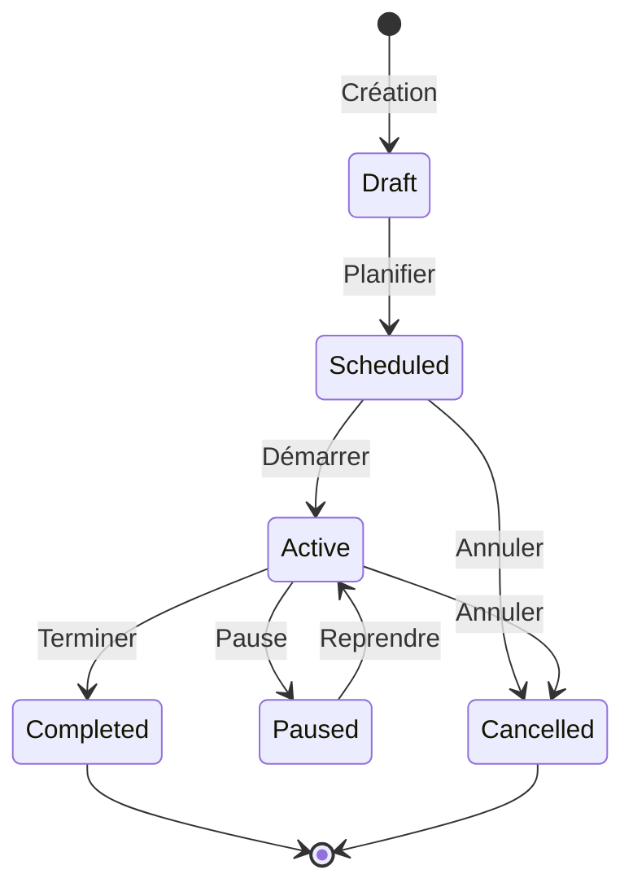
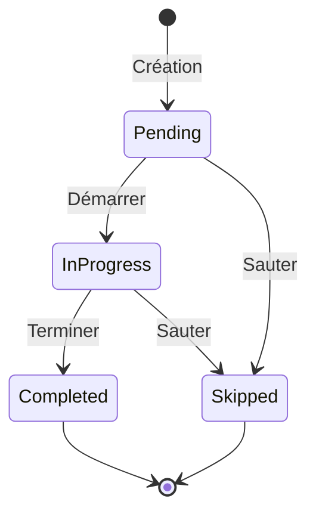

# 📋 Module Protocoles Thérapeutiques

> Plans de traitement structurés avec étapes, jalons et suivi de progression

---

## 📋 Vue d'Ensemble

Le module Protocoles permet aux praticiens de créer et gérer des plans de traitement structurés. Chaque protocole comprend des étapes séquentielles, des jalons thérapeutiques, et un suivi détaillé de la progression du patient.

### Fonctionnalités Principales
- ✅ Templates de protocoles système et personnalisés
- ✅ Étapes avec phases (initial, traitement, maintenance, clôture)
- ✅ Jalons avec déclencheurs automatiques
- ✅ Liaison avec sessions, questionnaires et échelles
- ✅ Suivi de progression en temps réel
- ✅ Portail patient avec accès par token
- ✅ Rapports de progression et finaux
- ✅ Export PDF multilingue

---

## 🗄️ Modèle de Données

### Table `protocols` (Templates Master)

| Champ | Type | Description |
|-------|------|-------------|
| `id` | UUID | Identifiant unique |
| `tenant_id` | UUID (FK, nullable) | NULL = protocole système |
| `name` | string | Nom du protocole |
| `name_i18n` | JSON | Nom multilingue |
| `description` | text | Description |
| `description_i18n` | JSON | Description multilingue |
| `steps` | JSON | Structure des étapes |
| `total_sessions` | integer | Nombre total de sessions |
| `recommended_interval_days` | integer | Intervalle entre sessions |
| `is_active` | boolean | Protocole actif |
| `is_system` | boolean | Protocole système |
| `practitioner_types` | JSON | Types de praticiens |
| `sort_order` | integer | Ordre d'affichage |

### Table `protocol_templates`

| Champ | Type | Description |
|-------|------|-------------|
| `id` | UUID | Identifiant |
| `tenant_id` | UUID (FK) | Tenant |
| `name` | JSON | Nom multilingue |
| `description` | JSON | Description |
| `status` | enum | draft, published, archived |
| `practitioner_type` | string | Type de praticien |
| `steps` | JSON | Définition des étapes |
| `milestones` | JSON | Définition des jalons |
| `estimated_duration_days` | integer | Durée estimée |
| `recommended_interval_days` | integer | Intervalle sessions |
| `total_sessions` | integer | Nombre de sessions |
| `tags` | JSON | Tags de catégorisation |
| `is_system` | boolean | Template système |
| `usage_count` | integer | Nombre d'utilisations |
| `published_at` | timestamp | Date de publication |
| `archived_at` | timestamp | Date d'archivage |

### Table `patient_protocols`

| Champ | Type | Description |
|-------|------|-------------|
| `id` | UUID | Identifiant |
| `tenant_id` | UUID (FK) | Tenant |
| `reference` | string | Référence unique (PROT-YYYY-XXXXX) |
| `patient_id` | UUID (FK) | Patient |
| `practitioner_id` | UUID (FK) | Praticien |
| `template_id` | UUID (FK, nullable) | Template source |
| `name` | JSON | Nom multilingue |
| `description` | JSON | Description |
| `status` | enum | draft, scheduled, active, paused, completed, cancelled |
| `scheduled_start_date` | date | Date de début prévue |
| `started_at` | timestamp | Date de début réelle |
| `due_date` | date | Date d'échéance |
| `completed_at` | timestamp | Date de complétion |
| `cancelled_at` | timestamp | Date d'annulation |
| `paused_at` | timestamp | Date de pause |
| `cancellation_reason` | enum | Raison d'annulation |
| `cancellation_notes` | text | Notes d'annulation |
| `estimated_duration_days` | integer | Durée estimée |
| `current_step` | integer | Étape actuelle |
| `progress_percentage` | integer | Progression 0-100 |
| `portal_access_token` | string | Token d'accès patient |
| `portal_token_expires_at` | timestamp | Expiration token |
| `metadata` | JSON | Données additionnelles |

### Table `patient_protocol_steps`

| Champ | Type | Description |
|-------|------|-------------|
| `id` | UUID | Identifiant |
| `tenant_id` | UUID (FK) | Tenant |
| `patient_protocol_id` | UUID (FK) | Protocole patient |
| `order_index` | integer | Ordre de l'étape |
| `name` | JSON | Nom multilingue |
| `description` | JSON | Description |
| `phase` | enum | initial, treatment, maintenance, closure |
| `status` | enum | pending, in_progress, completed, skipped |
| `scheduled_date` | date | Date prévue |
| `started_at` | timestamp | Date de début |
| `completed_at` | timestamp | Date de complétion |
| `skipped_at` | timestamp | Date de saut |
| `expected_duration_days` | integer | Durée prévue |
| `actual_duration_days` | integer | Durée réelle |
| `acts` | JSON | Actes à réaliser (UUIDs) |
| `questionnaires` | JSON | Questionnaires liés |
| `scales` | JSON | Échelles à administrer |
| `session_id` | UUID (FK, nullable) | Session liée |
| `patient_instructions` | JSON | Instructions patient |
| `practitioner_notes` | text | Notes praticien |
| `is_optional` | boolean | Étape optionnelle |
| `requires_session` | boolean | Nécessite session |
| `skip_reason` | text | Raison du saut |

### Table `patient_protocol_milestones`

| Champ | Type | Description |
|-------|------|-------------|
| `id` | UUID | Identifiant |
| `tenant_id` | UUID (FK) | Tenant |
| `patient_protocol_id` | UUID (FK) | Protocole |
| `sort_order` | integer | Ordre |
| `name` | JSON | Nom multilingue |
| `description` | JSON | Description |
| `trigger_type` | enum | manual, date, step_completion, scale_score |
| `trigger_config` | JSON | Configuration du déclencheur |
| `status` | enum | pending, achieved, failed |
| `target_date` | date | Date cible |
| `achieved_at` | timestamp | Date d'atteinte |
| `failed_at` | timestamp | Date d'échec |
| `evaluated_by` | UUID (FK) | Évaluateur |
| `success_criteria` | JSON | Critères de succès |
| `evaluation_notes` | text | Notes d'évaluation |

### Types de Déclencheurs

| Type | Description | Configuration |
|------|-------------|---------------|
| `manual` | Évaluation manuelle praticien | - |
| `date` | Atteint à une date | `target_date` |
| `step_completion` | Quand étape X complétée | `step_order` |
| `scale_score` | Score d'échelle atteint | `scale_id`, `threshold`, `comparison` |

---

## 🔌 API Endpoints

### Protocoles (Templates)

```http
GET    /api/v1/protocols                          # Liste protocoles
POST   /api/v1/protocols                          # Créer protocole custom
GET    /api/v1/protocols/{id}                     # Détail
PUT    /api/v1/protocols/{id}                     # Modifier
DELETE /api/v1/protocols/{id}                     # Supprimer
POST   /api/v1/protocols/{id}/duplicate           # Dupliquer
POST   /api/v1/protocols/{id}/apply               # Appliquer à patient
GET    /api/v1/protocols/{id}/pdf                 # PDF du template
```

### Templates Avancés

```http
GET    /api/v1/protocol-templates                 # Liste templates
POST   /api/v1/protocol-templates                 # Créer template
GET    /api/v1/protocol-templates/{id}            # Détail
PUT    /api/v1/protocol-templates/{id}            # Modifier
DELETE /api/v1/protocol-templates/{id}            # Supprimer
POST   /api/v1/protocol-templates/{id}/publish    # Publier
POST   /api/v1/protocol-templates/{id}/archive    # Archiver
POST   /api/v1/protocol-templates/{id}/duplicate  # Dupliquer
```

### Protocoles Patient

```http
GET    /api/v1/patient-protocols                  # Liste avec filtres
POST   /api/v1/patient-protocols                  # Assigner protocole
GET    /api/v1/patient-protocols/{id}             # Détail
PUT    /api/v1/patient-protocols/{id}             # Modifier
DELETE /api/v1/patient-protocols/{id}             # Supprimer
POST   /api/v1/patient-protocols/{id}/start       # Démarrer
POST   /api/v1/patient-protocols/{id}/pause       # Mettre en pause
POST   /api/v1/patient-protocols/{id}/resume      # Reprendre
POST   /api/v1/patient-protocols/{id}/complete    # Compléter
POST   /api/v1/patient-protocols/{id}/cancel      # Annuler
GET    /api/v1/patient-protocols/{id}/pdf         # PDF patient
```

### Étapes

```http
GET    /api/v1/patient-protocols/{id}/steps       # Liste étapes
GET    /api/v1/protocol-steps/{id}                # Détail étape
PATCH  /api/v1/protocol-steps/{id}                # Modifier étape
POST   /api/v1/protocol-steps/{id}/start          # Démarrer étape
POST   /api/v1/protocol-steps/{id}/complete       # Compléter étape
POST   /api/v1/protocol-steps/{id}/skip           # Sauter étape
POST   /api/v1/protocol-steps/{id}/link-session   # Lier session
```

### Jalons

```http
GET    /api/v1/patient-protocols/{id}/milestones  # Liste jalons
POST   /api/v1/patient-protocols/{id}/milestones  # Créer jalon
PATCH  /api/v1/protocol-milestones/{id}           # Modifier jalon
DELETE /api/v1/protocol-milestones/{id}           # Supprimer jalon
POST   /api/v1/protocol-milestones/{id}/achieve   # Marquer atteint
POST   /api/v1/protocol-milestones/{id}/fail      # Marquer échoué
```

### Notes & Rapports

```http
GET    /api/v1/patient-protocols/{id}/notes       # Liste notes
POST   /api/v1/patient-protocols/{id}/notes       # Ajouter note
POST   /api/v1/patient-protocols/{id}/reports     # Générer rapport
GET    /api/v1/protocol-reports/{id}              # Détail rapport
```

---

## 🖥️ Interface Utilisateur

### Page Protocoles

**Composant** : `ProtocolsPage.tsx`

Fonctionnalités :
- Onglets : Mes Protocoles / Templates Système
- Filtres par type, statut, spécialité
- Vue grille ou liste
- Badges multilingues
- Actions : Créer, Dupliquer, Appliquer

> 🎨 **Illustration** : Grille de cards avec indicateurs de progression

---

### Formulaire de Protocole

**Composant** : `ProtocolFormPage.tsx`

Sections :
1. **Informations** : Nom (FR/EN/HE), description
2. **Étapes** : Drag & drop avec configuration
3. **Jalons** : Définition et déclencheurs
4. **Configuration** : Durée, intervalle, options

> 🎨 **Illustration** : Interface builder avec timeline

---

### Détail Protocole Patient

**Composant** : `PatientProtocolDetail.tsx`

Affichage :
- Timeline des étapes avec statuts
- Progression globale
- Jalons et leur état
- Sessions liées
- Notes et rapports

---

## ⚙️ Services Backend

### PatientProtocolService

```php
class PatientProtocolService
{
    // Assigner protocole à patient
    public function assignProtocol(
        Patient $patient,
        array $data,
        User $practitioner
    ): PatientProtocol;

    // Gestion du cycle de vie
    public function startProtocol(PatientProtocol $protocol): PatientProtocol;
    public function pauseProtocol(PatientProtocol $protocol): PatientProtocol;
    public function resumeProtocol(PatientProtocol $protocol): PatientProtocol;
    public function completeProtocol(PatientProtocol $protocol): PatientProtocol;
    public function cancelProtocol(
        PatientProtocol $protocol,
        ProtocolCancellationReasonEnum $reason,
        ?string $notes
    ): PatientProtocol;

    // Progression
    public function recalculateProgress(PatientProtocol $protocol): void;
}
```

### ProtocolStepService

```php
class ProtocolStepService
{
    public function startStep(PatientProtocolStep $step): PatientProtocolStep;
    public function completeStep(PatientProtocolStep $step): PatientProtocolStep;
    public function skipStep(PatientProtocolStep $step, string $reason): PatientProtocolStep;
    public function linkSession(PatientProtocolStep $step, Session $session): void;
}
```

### ProtocolMilestoneService

```php
class ProtocolMilestoneService
{
    // Évaluation automatique
    public function evaluateAutomatically(PatientProtocolMilestone $milestone): void;
    public function evaluateByDate(PatientProtocolMilestone $milestone): bool;
    public function evaluateByStepCompletion(PatientProtocolMilestone $milestone): bool;
    public function evaluateByScaleScore(PatientProtocolMilestone $milestone): bool;

    // Évaluation manuelle
    public function achieve(PatientProtocolMilestone $milestone, User $evaluator): void;
    public function fail(PatientProtocolMilestone $milestone, User $evaluator, string $notes): void;
}
```

---

## 🎨 Propositions d'Illustrations

### 1. Liste des Protocoles
```
┌─────────────────────────────────────────────────────────────┐
│ 📋 Protocoles Thérapeutiques                [+ Nouveau]     │
├─────────────────────────────────────────────────────────────┤
│ [Mes Protocoles] [Templates Système]    🔍 Rechercher...    │
├─────────────────────────────────────────────────────────────┤
│                                                             │
│ ┌───────────────────────────────────────────────────────┐  │
│ │ 📋 Protocole Lombalgies Chroniques                    │  │
│ │                                                       │  │
│ │ 8 étapes · 12 semaines · Ostéopathie                 │  │
│ │ 🏷️ FR EN HE                                          │  │
│ │                                                       │  │
│ │ Utilisé 23 fois                                       │  │
│ │                                                       │  │
│ │ [Aperçu]  [Dupliquer]  [Appliquer à patient]         │  │
│ └───────────────────────────────────────────────────────┘  │
│                                                             │
│ ┌───────────────────────────────────────────────────────┐  │
│ │ 📋 Programme Gestion du Stress                        │  │
│ │                                                       │  │
│ │ 6 étapes · 8 semaines · Naturopathie                 │  │
│ │ 🏷️ FR EN                                             │  │
│ │                                                       │  │
│ │ Utilisé 45 fois                                       │  │
│ │                                                       │  │
│ │ [Aperçu]  [Dupliquer]  [Appliquer à patient]         │  │
│ └───────────────────────────────────────────────────────┘  │
│                                                             │
└─────────────────────────────────────────────────────────────┘
```

### 2. Détail Protocole Patient avec Timeline
```
┌─────────────────────────────────────────────────────────────┐
│ 📋 PROT-2026-00142 - Marie Dupont                          │
│ Protocole Lombalgies Chroniques                             │
├─────────────────────────────────────────────────────────────┤
│ Statut: 🟢 ACTIF    Progression: ████████░░ 62%            │
│ Démarré: 15/12/2025    Échéance: 15/03/2026                │
├─────────────────────────────────────────────────────────────┤
│                                                             │
│  TIMELINE DES ÉTAPES                                        │
│                                                             │
│  ✅ Étape 1 - Bilan initial              [Phase: Initial]  │
│  │  Complétée le 15/12/2025                                │
│  │  Session #S-2025-00891 liée                             │
│  │                                                          │
│  ✅ Étape 2 - Première séance            [Phase: Traitement]│
│  │  Complétée le 22/12/2025                                │
│  │  Session #S-2025-00912 liée                             │
│  │                                                          │
│  ✅ Étape 3 - Deuxième séance            [Phase: Traitement]│
│  │  Complétée le 05/01/2026                                │
│  │                                                          │
│  ✅ Étape 4 - Troisième séance           [Phase: Traitement]│
│  │  Complétée le 19/01/2026                                │
│  │                                                          │
│  🔄 Étape 5 - Quatrième séance           [Phase: Traitement]│
│  │  En cours - Prévu: 02/02/2026                           │
│  │  [Lier session] [Compléter] [Sauter]                    │
│  │                                                          │
│  ○ Étape 6 - Cinquième séance            [Phase: Maintenance]│
│  │  Prévu: 16/02/2026                                      │
│  │                                                          │
│  ○ Étape 7 - Sixième séance              [Phase: Maintenance]│
│  │  Prévu: 02/03/2026                                      │
│  │                                                          │
│  ○ Étape 8 - Bilan final                 [Phase: Clôture]  │
│     Prévu: 15/03/2026                                      │
│                                                             │
├─────────────────────────────────────────────────────────────┤
│  JALONS                                                     │
│                                                             │
│  ✅ Réduction douleur -30%     Atteint le 19/01/2026       │
│  ○  Réduction douleur -50%     Cible: score EVA ≤ 4        │
│  ○  Autonomie exercices        Validation manuelle          │
│  ○  Objectif final atteint     Fin de protocole            │
│                                                             │
└─────────────────────────────────────────────────────────────┘
```

### 3. Formulaire Builder d'Étape
```
┌─────────────────────────────────────────────────────────────┐
│ ➕ Ajouter une étape                                        │
├─────────────────────────────────────────────────────────────┤
│                                                             │
│  Nom de l'étape *                                           │
│  ┌─────────────────────────────────────────────────────┐   │
│  │ 🇫🇷 Première séance de traitement                    │   │
│  │ 🇬🇧 First treatment session                          │   │
│  │ 🇮🇱 מפגש טיפול ראשון                                 │   │
│  └─────────────────────────────────────────────────────┘   │
│                                                             │
│  Phase                         Durée estimée                │
│  ┌─────────────────────┐      ┌─────────────────────┐      │
│  │ Traitement       ▼  │      │ 7          jours   │      │
│  └─────────────────────┘      └─────────────────────┘      │
│                                                             │
│  ☐ Étape optionnelle   ☑ Nécessite une session             │
│                                                             │
│  ─────────────────────────────────────────────────────────  │
│  Éléments liés                                              │
│                                                             │
│  Actes à réaliser :                                         │
│  ┌─────────────────────────────────────────────────────┐   │
│  │ + Ajouter un acte                                   │   │
│  │                                                     │   │
│  │ 🩺 Manipulation vertébrale                          │   │
│  │ 🩺 Techniques myofasciales                          │   │
│  └─────────────────────────────────────────────────────┘   │
│                                                             │
│  Questionnaires :                                           │
│  ┌─────────────────────────────────────────────────────┐   │
│  │ + Ajouter un questionnaire                          │   │
│  │                                                     │   │
│  │ 📋 Questionnaire douleur                            │   │
│  └─────────────────────────────────────────────────────┘   │
│                                                             │
│  Échelles :                                                 │
│  ┌─────────────────────────────────────────────────────┐   │
│  │ + Ajouter une échelle                               │   │
│  │                                                     │   │
│  │ 📊 EVA - Échelle Visuelle Analogique                │   │
│  └─────────────────────────────────────────────────────┘   │
│                                                             │
│  [Annuler]                                    [Ajouter]     │
└─────────────────────────────────────────────────────────────┘
```

---

## 📊 Workflow de Protocole



## 📊 Workflow d'Étape



---

## 🔗 Relations avec Autres Modules

| Module | Relation | Description |
|--------|----------|-------------|
| Patients | 1:N | Protocoles assignés |
| Sessions | N:M | Sessions liées aux étapes |
| Questionnaires | N:M | Questionnaires par étape |
| Scales | N:M | Échelles par étape (+ jalons) |
| Portal | - | Accès patient par token |
| Documents | 1:N | Rapports générés |

---

## 📚 Raisons d'Annulation

| Raison | Description |
|--------|-------------|
| `patient_request` | Demande du patient |
| `no_show` | Absences répétées |
| `non_compliance` | Non-respect des consignes |
| `goal_achieved` | Objectif atteint avant fin |
| `referral` | Réorientation vers spécialiste |
| `other` | Autre raison (notes) |

---

*Documentation générée pour PratiConnect v1.0*
