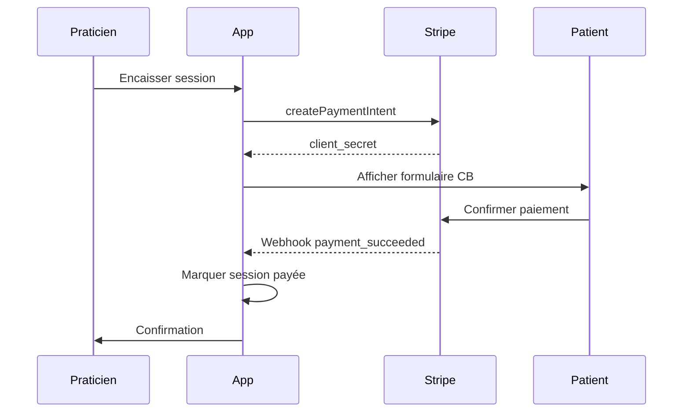
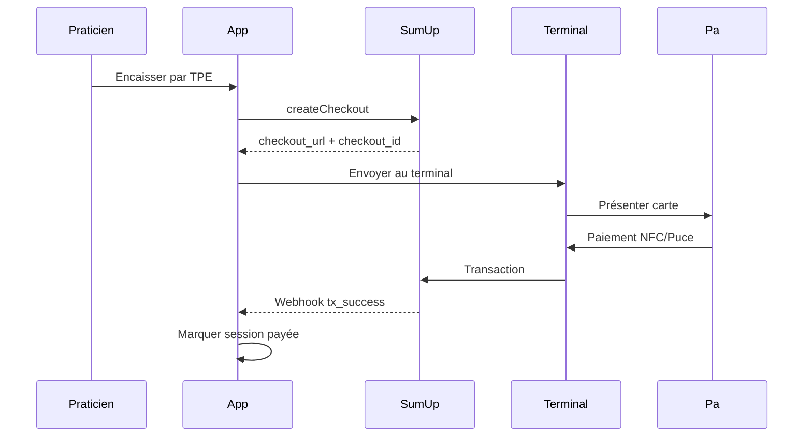
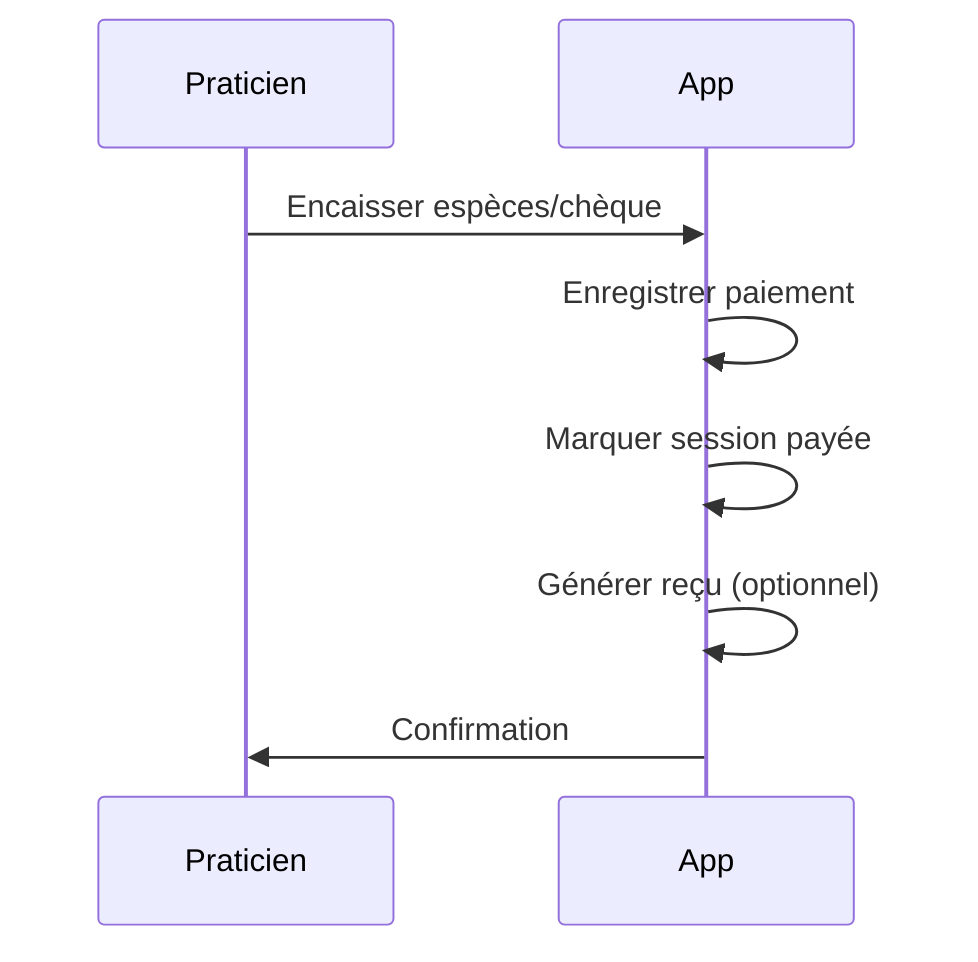

# 💰 Module Facturation & Paiements

> Multi-modes de paiement, facturation automatisée et gestion des abonnements

---

## 📋 Vue d'Ensemble

Le module Billing gère l'intégralité du cycle de facturation : encaissement des consultations (multi-modes), génération de factures, suivi des paiements, et gestion des abonnements à la plateforme.

### Fonctionnalités Principales
- ✅ Paiement par carte (Stripe)
- ✅ Paiement terminal (SumUp) - France
- ✅ Facturation israélienne (Green Invoice)
- ✅ Paiement manuel (espèces, chèque, virement)
- ✅ Génération de factures PDF
- ✅ Forfaits de séances (packages)
- ✅ Gestion des abonnements plateforme
- ✅ Export comptable

---

## 🏗️ Architecture du Module

### Pattern Factory - BillingManager

```php
class BillingManager
{
    public function processPayment(Session $session, array $data): PaymentResult
    {
        return match($this->getProvider($session)) {
            'stripe' => $this->stripeService->processPayment($session, $data),
            'sumup' => $this->sumUpService->processPayment($session, $data),
            'green_invoice' => $this->greenInvoiceService->processPayment($session, $data),
            'manual' => $this->processManualPayment($session, $data),
        };
    }

    protected function getProvider(Session $session): string
    {
        $user = $session->practitioner;
        return $user->payment_config['preferred_provider'] ?? 'stripe';
    }
}
```

### Providers par Région

| Région | Providers Disponibles |
|--------|----------------------|
| France | Stripe, SumUp |
| Israël | Stripe, Green Invoice |
| International | Stripe |
| Tous | Manuel (espèces, chèque, virement) |

---

## 🗄️ Modèle de Données

### Table `invoices` (Plateforme → Praticien)

| Champ | Type | Description |
|-------|------|-------------|
| `id` | UUID | Identifiant |
| `tenant_id` | UUID (FK) | Tenant |
| `patient_id` | UUID (FK) | Patient |
| `invoice_number` | string | Numéro unique |
| `subtotal` | decimal | Sous-total HT |
| `tax_rate` | decimal | Taux TVA |
| `tax_amount` | decimal | Montant TVA |
| `total_amount` | decimal | Total TTC |
| `status` | enum | pending/paid/cancelled/overdue |
| `issued_at` | timestamp | Date émission |
| `paid_at` | timestamp | Date paiement |
| `due_date` | date | Date échéance |

### Table `practitioner_invoices` (Praticien → Patient)

| Champ | Type | Description |
|-------|------|-------------|
| `id` | UUID | Identifiant |
| `tenant_id` | UUID (FK) | Tenant |
| `practitioner_id` | UUID (FK) | Praticien |
| `patient_id` | UUID (FK) | Patient |
| `invoice_number` | string | Numéro (format: INV-2026-00001) |
| `subtotal` | decimal | Sous-total |
| `tax_rate` | decimal | Taux TVA (si applicable) |
| `tax_amount` | decimal | TVA |
| `total_amount` | decimal | Total |
| `currency` | string | EUR/ILS |
| `payment_method` | enum | stripe/sumup/bank_transfer/cash/check/external |
| `payment_mode` | enum | payment_link/tpe |
| `stripe_payment_intent_id` | string | ID Stripe |
| `sumup_checkout_id` | string | ID SumUp |
| `green_invoice_id` | string | ID Green Invoice |
| `external_invoice_url` | string | URL facture hébergée |
| `status` | enum | draft/sent/paid/cancelled/refunded |
| `issued_at` | timestamp | Émission |
| `sent_at` | timestamp | Envoi |
| `paid_at` | timestamp | Paiement |

### Table `session_packages`

| Champ | Type | Description |
|-------|------|-------------|
| `id` | UUID | Identifiant |
| `tenant_id` | UUID (FK) | Tenant |
| `practitioner_id` | UUID (FK) | Praticien |
| `title` | string | Nom du forfait |
| `description` | text | Description |
| `session_count` | integer | Nombre de séances |
| `price_cents` | integer | Prix en centimes |
| `currency` | string | Devise |
| `validity_days` | integer | Validité en jours |
| `is_active` | boolean | Actif |

### Table `patient_packages`

| Champ | Type | Description |
|-------|------|-------------|
| `id` | UUID | Identifiant |
| `patient_id` | UUID (FK) | Patient |
| `session_package_id` | UUID (FK) | Forfait |
| `practitioner_invoice_id` | UUID (FK) | Facture d'achat |
| `remaining_sessions` | integer | Sessions restantes |
| `purchased_at` | timestamp | Date achat |
| `expires_at` | timestamp | Date expiration |

---

## 🔌 API Endpoints

### Dashboard & Stats

```http
GET    /api/v1/billing/dashboard          # Dashboard facturation
GET    /api/v1/billing/statistics         # Statistiques
```

### Configuration

```http
GET    /api/v1/billing/business-identity  # Identité entreprise
PUT    /api/v1/billing/business-identity  # Mettre à jour

GET    /api/v1/billing/bank-details       # Coordonnées bancaires
PUT    /api/v1/billing/bank-details       # Mettre à jour

GET    /api/v1/billing/payment-methods    # Modes de paiement
POST   /api/v1/billing/payment-methods    # Configurer

GET    /api/v1/billing/available-providers  # Providers disponibles
```

### Paiements Stripe

```http
POST   /api/v1/payments/stripe/payment-intent   # Créer intent
POST   /api/v1/payments/stripe/payment-link     # Créer lien
POST   /api/v1/payments/stripe/save-card        # Sauvegarder carte
GET    /api/v1/payments/stripe/cards/{patientId}  # Cartes enregistrées
DELETE /api/v1/payments/stripe/cards/{id}       # Supprimer carte
```

### Paiements SumUp

```http
POST   /api/v1/payments/sumup/checkout          # Créer checkout
```

### Paiements Manuels

```http
POST   /api/v1/payments/manual                  # Enregistrer manuel
```

### Factures Praticien → Patient

```http
GET    /api/v1/invoices                         # Liste
POST   /api/v1/invoices                         # Créer
GET    /api/v1/invoices/{id}                    # Détail
PUT    /api/v1/invoices/{id}                    # Modifier
DELETE /api/v1/invoices/{id}                    # Supprimer
GET    /api/v1/invoices/{id}/download           # Télécharger PDF
POST   /api/v1/invoices/{id}/send               # Envoyer au patient
POST   /api/v1/invoices/{id}/mark-paid          # Marquer payé
POST   /api/v1/invoices/{id}/mark-unpaid        # Marquer impayé
POST   /api/v1/invoices/{id}/refund             # Rembourser
GET    /api/v1/invoices-export                  # Export CSV
```

### Forfaits de Séances

```http
GET    /api/v1/session-packages                 # Liste
POST   /api/v1/session-packages                 # Créer
PUT    /api/v1/session-packages/{id}            # Modifier
DELETE /api/v1/session-packages/{id}            # Supprimer
POST   /api/v1/session-packages/{id}/toggle-active  # Activer/désactiver
POST   /api/v1/session-packages/{id}/purchase   # Acheter pour patient

GET    /api/v1/patient-packages                 # Forfaits patient
GET    /api/v1/patient-packages/{id}            # Détail
DELETE /api/v1/patient-packages/{id}            # Supprimer
```

---

## 🖥️ Interface Utilisateur

### Page Facturation

**Composant** : `BillingPage.tsx`

Sections :
1. **KPIs** : CA du mois, factures en attente, taux de paiement
2. **Liste des factures** : Filtrable par statut, date, patient
3. **Actions rapides** : Nouvelle facture, export

> 🎨 **Illustration** : Dashboard avec 4 cartes KPI en haut, tableau de factures avec badges de statut colorés

---

### Modal Encaissement

**Composant** : `CollectPaymentModal.tsx`

Étapes :
1. **Récapitulatif** : Montant, actes
2. **Choix du mode** : CB, Espèces, Chèque, Virement, Lien de paiement
3. **Exécution** : Selon le mode choisi
4. **Confirmation** : Reçu généré

> 🎨 **Illustration** : Modal avec montant "85,00€", grille de boutons (💳 CB, 💵 Espèces, 📄 Chèque...)

---

### Création de Facture

**Composant** : `InvoiceFormModal.tsx`

Champs :
- Patient (sélection)
- Date de facturation
- Lignes de facturation (actes avec quantité/prix)
- TVA (si applicable)
- Notes
- Date d'échéance

> 🎨 **Illustration** : Formulaire avec tableau éditable de lignes, total auto-calculé, aperçu PDF à droite

---

### Configuration Paiements

**Composant** : `PaymentIntegrationsSettings.tsx`

Intégrations :
- **Stripe** : Connexion OAuth, clés API
- **SumUp** : Connexion marchant, terminal
- **Green Invoice** : Credentials API

> 🎨 **Illustration** : Cards d'intégration avec statut (✅ Connecté / ⚠️ Non configuré), boutons de connexion

---

## ⚙️ Services Backend

### StripeService

```php
class StripeService
{
    // Création de PaymentIntent
    public function createPaymentIntent(Session $session, int $amount): PaymentIntent;

    // Confirmation de paiement
    public function confirmPayment(string $paymentIntentId): PaymentIntent;

    // Remboursement
    public function refundPayment(string $paymentIntentId, ?int $amount = null): Refund;

    // Gestion des cartes
    public function getPaymentMethods(Patient $patient): Collection;
    public function savePaymentMethod(Patient $patient, string $paymentMethodId): void;
    public function deletePaymentMethod(string $paymentMethodId): void;

    // Liens de paiement
    public function createPaymentLink(Session $session, int $amount): string;
}
```

### SumUpService

```php
class SumUpService
{
    // Vérification disponibilité (France uniquement)
    public function canUseSumUp(User $user): bool;

    // Création de checkout
    public function createCheckout(Session $session, int $amount): array;

    // Vérification du statut
    public function getPaymentStatus(string $checkoutId): string;

    // Remboursement
    public function refundTransaction(string $transactionId): void;
}
```

### GreenInvoiceService

```php
class GreenInvoiceService
{
    // Création de facture
    public function createInvoice(Session $session, array $items): array;

    // Envoi par email
    public function sendInvoice(string $invoiceId, string $email): void;

    // Test de connexion
    public function testConnection(): bool;
}
```

### PractitionerInvoiceService

```php
class PractitionerInvoiceService
{
    // Génération de numéro
    public function generateInvoiceNumber(User $practitioner): string;

    // Création de facture
    public function createInvoice(array $data): PractitionerInvoice;

    // Génération PDF
    public function generatePdf(PractitionerInvoice $invoice): string;

    // Envoi au patient
    public function sendToPatient(PractitionerInvoice $invoice): void;

    // Export comptable
    public function exportForAccounting(User $practitioner, Carbon $from, Carbon $to): string;
}
```

---

## 💳 Flux de Paiement

### Paiement Carte (Stripe)



### Paiement Terminal (SumUp)



### Paiement Manuel



---

## 📄 Génération de Factures PDF

### Structure du PDF

```
┌─────────────────────────────────────────────────────────────┐
│                    FACTURE INV-2026-00042                   │
├─────────────────────────────────────────────────────────────┤
│                                                             │
│  De:                          À:                            │
│  Dr. Jean Martin              Marie Dupont                  │
│  Cabinet d'Ostéopathie        12 rue des Lilas             │
│  25 avenue de la Santé        75001 Paris                   │
│  75015 Paris                                                │
│  SIRET: 123 456 789 00012                                   │
│                                                             │
├─────────────────────────────────────────────────────────────┤
│  Date: 25/01/2026             Échéance: 25/02/2026          │
├─────────────────────────────────────────────────────────────┤
│                                                             │
│  Description                    Qté    Prix     Total       │
│  ─────────────────────────────────────────────────────────  │
│  Consultation ostéopathique      1    60,00€   60,00€       │
│  Strapping thérapeutique         1    25,00€   25,00€       │
│  ─────────────────────────────────────────────────────────  │
│                                                             │
│                               Sous-total:      85,00€       │
│                               TVA (0%):         0,00€       │
│                               ────────────────────────      │
│                               TOTAL:           85,00€       │
│                                                             │
├─────────────────────────────────────────────────────────────┤
│  Statut: PAYÉ le 25/01/2026 par Carte bancaire              │
│                                                             │
│  Mention légale: Non assujetti à la TVA (article 261-4-1°)  │
└─────────────────────────────────────────────────────────────┘
```

---

## 📊 Forfaits de Séances

### Création de Forfait

```typescript
interface SessionPackage {
  title: string;           // "Forfait 10 séances"
  description: string;     // Description
  session_count: number;   // 10
  price_cents: number;     // 50000 (500€)
  validity_days: number;   // 365
  is_active: boolean;
}
```

### Utilisation d'un Forfait

1. Patient achète un forfait → `patient_packages` créé
2. À chaque session → décrémente `remaining_sessions`
3. Quand `remaining_sessions = 0` → forfait épuisé
4. Si `expires_at` atteint → forfait expiré

---

## 🎨 Propositions d'Illustrations

### 1. Dashboard Facturation
```
┌─────────────────────────────────────────────────────────────┐
│ 💰 Facturation                                              │
├─────────────────────────────────────────────────────────────┤
│                                                             │
│ ┌────────────┐ ┌────────────┐ ┌────────────┐ ┌────────────┐│
│ │ CA Mois    │ │ En attente │ │ Payées     │ │ Taux       ││
│ │            │ │            │ │            │ │            ││
│ │  3 450€    │ │    425€    │ │  3 025€    │ │   87.7%    ││
│ │  +12% ↑    │ │  3 factures│ │ 28 factures│ │  +2.3% ↑   ││
│ └────────────┘ └────────────┘ └────────────┘ └────────────┘│
│                                                             │
├─────────────────────────────────────────────────────────────┤
│ Factures récentes                        [+ Nouvelle] [📤] │
├─────────────────────────────────────────────────────────────┤
│ │ N°       │ Patient        │ Montant │ Statut   │ Date   ││
│ ├──────────┼────────────────┼─────────┼──────────┼────────┤│
│ │INV-00042 │ Marie Dupont   │   85€   │ 🟢 Payée │ 25/01 ││
│ │INV-00041 │ Pierre Martin  │  120€   │ 🟡 Envoyée│ 24/01 ││
│ │INV-00040 │ Sophie Bernard │   60€   │ 🟢 Payée │ 24/01 ││
│ │INV-00039 │ Jean Durand    │   85€   │ 🔴 Retard│ 15/01 ││
│ └──────────┴────────────────┴─────────┴──────────┴────────┘│
└─────────────────────────────────────────────────────────────┘
```

### 2. Modal Encaissement
```
┌─────────────────────────────────────────────────────────────┐
│                💰 Encaisser le paiement                     │
├─────────────────────────────────────────────────────────────┤
│                                                             │
│  Session: Consultation ostéo - Marie Dupont                 │
│  Montant: 85,00€                                            │
│                                                             │
│  ─────────────────────────────────────────────────────────  │
│                                                             │
│  Choisissez le mode de paiement:                            │
│                                                             │
│  ┌─────────────┐  ┌─────────────┐  ┌─────────────┐         │
│  │     💳      │  │     📱      │  │     💵      │         │
│  │   Carte     │  │   Terminal  │  │   Espèces   │         │
│  │  bancaire   │  │    SumUp    │  │             │         │
│  └─────────────┘  └─────────────┘  └─────────────┘         │
│                                                             │
│  ┌─────────────┐  ┌─────────────┐  ┌─────────────┐         │
│  │     📄      │  │     🏦      │  │     🔗      │         │
│  │   Chèque    │  │   Virement  │  │   Lien de   │         │
│  │             │  │             │  │   paiement  │         │
│  └─────────────┘  └─────────────┘  └─────────────┘         │
│                                                             │
│                       [ Annuler ]                           │
└─────────────────────────────────────────────────────────────┘
```

### 3. Configuration Intégrations
```
┌─────────────────────────────────────────────────────────────┐
│ ⚙️ Intégrations de paiement                                 │
├─────────────────────────────────────────────────────────────┤
│                                                             │
│ ┌─────────────────────────────────────────────────────────┐ │
│ │ 💳 Stripe                                    ✅ Connecté │ │
│ │ Paiements par carte bancaire en ligne                   │ │
│ │                                                         │ │
│ │ Compte: acct_1234567890                                 │ │
│ │ Mode: Production                                        │ │
│ │                                                         │ │
│ │ [ Configurer ]  [ Déconnecter ]                        │ │
│ └─────────────────────────────────────────────────────────┘ │
│                                                             │
│ ┌─────────────────────────────────────────────────────────┐ │
│ │ 📱 SumUp                                  ⚠️ Non configuré│ │
│ │ Terminal de paiement (France uniquement)                │ │
│ │                                                         │ │
│ │ Connectez votre compte SumUp pour accepter les          │ │
│ │ paiements par carte en cabinet avec votre terminal.     │ │
│ │                                                         │ │
│ │ [ Connecter SumUp ]                                     │ │
│ └─────────────────────────────────────────────────────────┘ │
│                                                             │
│ ┌─────────────────────────────────────────────────────────┐ │
│ │ 🧾 Green Invoice                          ❌ Indisponible │ │
│ │ Facturation israélienne                                 │ │
│ │                                                         │ │
│ │ Ce service n'est disponible que pour les praticiens     │ │
│ │ basés en Israël.                                        │ │
│ └─────────────────────────────────────────────────────────┘ │
└─────────────────────────────────────────────────────────────┘
```

### 4. Gestion des Forfaits
```
┌─────────────────────────────────────────────────────────────┐
│ 📦 Forfaits de séances                       [+ Créer]      │
├─────────────────────────────────────────────────────────────┤
│                                                             │
│ ┌─────────────────────────────────────────────────────────┐ │
│ │ 🎫 Forfait 5 séances                          ✅ Actif   │ │
│ │ 5 consultations de suivi                                │ │
│ │                                                         │ │
│ │ Prix: 250€  │  Validité: 6 mois  │  Vendus: 12         │ │
│ │                                                         │ │
│ │ [ Modifier ]  [ Désactiver ]                           │ │
│ └─────────────────────────────────────────────────────────┘ │
│                                                             │
│ ┌─────────────────────────────────────────────────────────┐ │
│ │ 🎫 Forfait 10 séances                         ✅ Actif   │ │
│ │ 10 consultations de suivi (économie 100€)               │ │
│ │                                                         │ │
│ │ Prix: 500€  │  Validité: 12 mois │  Vendus: 8          │ │
│ │                                                         │ │
│ │ [ Modifier ]  [ Désactiver ]                           │ │
│ └─────────────────────────────────────────────────────────┘ │
│                                                             │
│ ┌─────────────────────────────────────────────────────────┐ │
│ │ 🎫 Pack Première année                       ⬜ Inactif  │ │
│ │ 15 séances découverte                                   │ │
│ │                                                         │ │
│ │ Prix: 700€  │  Validité: 12 mois │  Vendus: 3          │ │
│ │                                                         │ │
│ │ [ Modifier ]  [ Activer ]                              │ │
│ └─────────────────────────────────────────────────────────┘ │
└─────────────────────────────────────────────────────────────┘
```

---

## 🔗 Relations avec Autres Modules

| Module | Relation | Description |
|--------|----------|-------------|
| Sessions | 1:N | Paiement de session |
| Patients | 1:N | Factures patient |
| Acts | N:M | Lignes de facture |
| Integrations | 1:N | Configuration paiement |
| Teleconsultation | 1:1 | Prépaiement |

---

## 📝 Notes d'Implémentation

### Webhooks

**Stripe** (`/webhooks/stripe`) :
- `payment_intent.succeeded` → Marquer payé
- `payment_intent.payment_failed` → Notifier échec
- `invoice.paid` → Abonnement renouvelé

**SumUp** (`/webhooks/sumup`) :
- `SUCCESSFUL` → Marquer payé
- `FAILED` → Notifier échec

### Numérotation des Factures

```php
// Format: INV-{YEAR}-{SEQUENCE}
// Exemple: INV-2026-00042
$number = sprintf('INV-%04d-%05d', now()->year, $sequence);
```

### Export Comptable

Format CSV avec colonnes :
- Date, N° facture, Client, Montant HT, TVA, TTC, Mode paiement, Statut

---

*Documentation générée pour PratiConnect v1.0*
