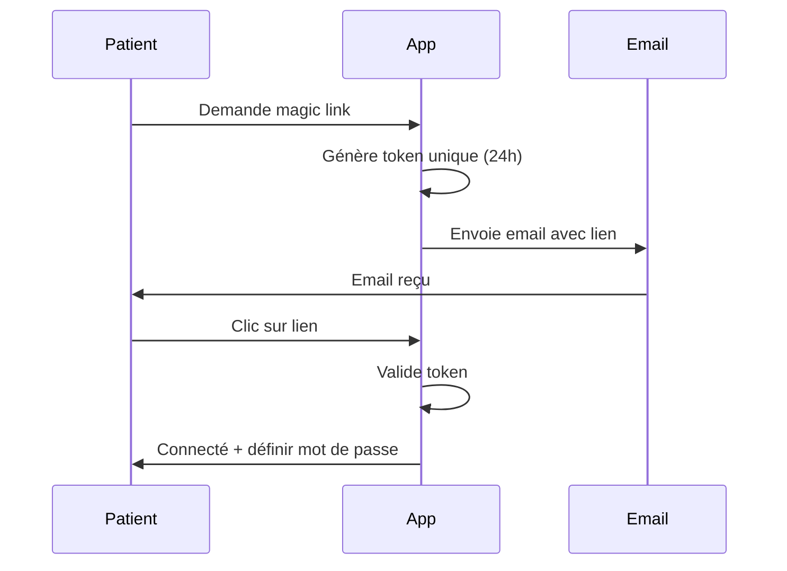

# 📱 Module Portail Patient

> Espace patient sécurisé avec accès autonome aux rendez-vous, documents et questionnaires

---

## 📋 Vue d'Ensemble

Le Portail Patient est une application web dédiée permettant aux patients d'accéder à leur dossier médical, prendre rendez-vous, remplir des questionnaires, rejoindre des téléconsultations et consulter leurs factures de manière autonome.

### Fonctionnalités Principales
- ✅ Dashboard personnalisé
- ✅ Prise de rendez-vous en ligne
- ✅ Questionnaires à compléter
- ✅ Accès aux documents partagés
- ✅ Téléconsultation vidéo
- ✅ Sessions collectives
- ✅ Médias thérapeutiques
- ✅ Historique des factures
- ✅ Profil et paramètres
- ✅ Authentification Magic Link

---

## 🔐 Authentification

### Méthodes Disponibles

| Méthode | Description | Utilisation |
|---------|-------------|-------------|
| **Magic Link** | Lien unique par email | Première connexion, mot de passe oublié |
| **Email/Password** | Classique | Connexions régulières |
| **Token temporaire** | URL signée | Accès direct à questionnaire/échelle |

### Flux Magic Link



### Table `patient_magic_links`

| Champ | Type | Description |
|-------|------|-------------|
| `id` | UUID | Identifiant |
| `patient_id` | UUID (FK) | Patient |
| `token` | string | Token unique |
| `expires_at` | timestamp | Expiration (24h) |
| `used_at` | timestamp | Date d'utilisation |

---

## 🔌 API Endpoints

### Authentification Portail

```http
POST   /api/v1/patient-portal/auth/login           # Connexion
POST   /api/v1/patient-portal/auth/magic-link      # Demander magic link
GET    /api/v1/patient-portal/auth/magic-link/verify/{token}  # Vérifier
POST   /api/v1/patient-portal/auth/register        # Inscription
POST   /api/v1/patient-portal/auth/forgot-password # Mot de passe oublié
POST   /api/v1/patient-portal/auth/reset-password  # Réinitialiser
POST   /api/v1/patient-portal/auth/set-password    # Définir (après magic link)
GET    /api/v1/patient-portal/auth/practitioner    # Lookup praticien
```

### Routes Protégées

```http
POST   /api/v1/patient-portal/auth/refresh         # Refresh token
POST   /api/v1/patient-portal/logout               # Déconnexion
GET    /api/v1/patient-portal/me                   # Profil patient
GET    /api/v1/patient-portal/dashboard            # Dashboard
```

### Rendez-vous

```http
GET    /api/v1/patient-portal/appointments         # Liste RDV
GET    /api/v1/patient-portal/appointments/upcoming # À venir
POST   /api/v1/patient-portal/appointments         # Réserver
POST   /api/v1/patient-portal/appointments/{id}/cancel  # Annuler
GET    /api/v1/patient-portal/available-slots      # Créneaux disponibles
```

### Questionnaires

```http
GET    /api/v1/patient-portal/questionnaires       # Liste à remplir
GET    /api/v1/patient-portal/questionnaires/{id}  # Détail
POST   /api/v1/patient-portal/questionnaires/{id}/respond  # Répondre
```

### Documents

```http
GET    /api/v1/patient-portal/documents            # Documents partagés
GET    /api/v1/patient-portal/documents/{id}       # Détail
GET    /api/v1/patient-portal/documents/{id}/download  # Télécharger
GET    /api/v1/patient-portal/documents/{id}/stream    # Streaming
POST   /api/v1/patient-portal/documents/upload     # Upload (patient)
GET    /api/v1/patient-portal/documents/my-uploads # Mes uploads
```

### Factures

```http
GET    /api/v1/patient-portal/invoices             # Liste factures
GET    /api/v1/patient-portal/invoices/{id}        # Détail
GET    /api/v1/patient-portal/invoices/{id}/download  # Télécharger
POST   /api/v1/patient-portal/invoices/{id}/pay    # Payer en ligne
```

### Téléconsultation

```http
GET    /api/v1/patient-portal/teleconsultations/active    # Session active
GET    /api/v1/patient-portal/teleconsultation/{id}/token # Token LiveKit
GET    /api/v1/patient-portal/teleconsultation/{id}/join  # Rejoindre
GET    /api/v1/patient-portal/teleconsultation/{id}/status # Statut
POST   /api/v1/patient-portal/teleconsultation/{id}/consent-recording  # Consentement
```

### Sessions Collectives

```http
GET    /api/v1/patient-portal/collective-sessions          # Liste
GET    /api/v1/patient-portal/collective-sessions/{id}/slots  # Créneaux
POST   /api/v1/patient-portal/collective-slots/{id}/register   # S'inscrire
POST   /api/v1/patient-portal/collective-slots/{id}/unregister # Se désinscrire
GET    /api/v1/patient-portal/my-collective-registrations  # Mes inscriptions
GET    /api/v1/patient-portal/my-collective-packages       # Mes forfaits
```

### Protocoles

```http
GET    /api/v1/patient-portal/protocols            # Mes protocoles
GET    /api/v1/patient-portal/protocols/{id}       # Détail
GET    /api/v1/patient-portal/protocols/{id}/pdf   # Télécharger PDF
```

### Profil

```http
GET    /api/v1/patient-portal/profile              # Mon profil
PUT    /api/v1/patient-portal/profile              # Modifier
POST   /api/v1/patient-portal/profile/password     # Changer mot de passe
```

### Praticiens Connectés

```http
GET    /api/v1/patient-portal/connected-practitioners  # Mes praticiens
DELETE /api/v1/patient-portal/connected-practitioners/{id}  # Révoquer accès
```

---

## 🖥️ Interface Utilisateur

### Dashboard Patient

**Composant** : `PatientDashboard.tsx`

Widgets :
- 📅 Prochains rendez-vous
- 📝 Questionnaires en attente
- 📄 Documents récents
- 💰 Factures à payer
- 🎵 Médias thérapeutiques assignés
- 📈 Score de bien-être

> 🎨 **Illustration** : Dashboard mobile-first avec cards empilées, notification badges sur questionnaires

---

### Page Rendez-vous

**Composant** : `AppointmentsPage.tsx`

Fonctionnalités :
- Liste des rendez-vous à venir
- Historique des consultations
- Bouton "Réserver un RDV"
- Actions : Annuler, Rejoindre (si téléconsultation)

> 🎨 **Illustration** : Liste de cards RDV avec date, heure, praticien, badge "Téléconsultation"

---

### Réservation en Ligne

**Composant** : `BookingPage.tsx`

Étapes :
1. **Choix du type** : Consultation, Suivi, Bilan...
2. **Sélection de date** : Calendrier avec disponibilités
3. **Choix du créneau** : Heures disponibles
4. **Confirmation** : Récapitulatif + paiement (si requis)

> 🎨 **Illustration** : Wizard de booking avec stepper, calendrier mini, créneaux en chips

---

### Page Questionnaires

**Composant** : `QuestionnairesPage.tsx`

Sections :
- **En attente** : Questionnaires à remplir (badge rouge)
- **Complétés** : Historique avec dates

> 🎨 **Illustration** : Liste avec badges "Nouveau", dates d'échéance, bouton "Commencer"

---

### Page Documents

**Composant** : `DocumentsPage.tsx`

Organisation :
- Liste par catégorie
- Vignettes avec type de fichier
- Actions : Télécharger, Voir en ligne

> 🎨 **Illustration** : Grille de documents avec icônes (PDF, image), date de partage

---

### Page Téléconsultation

**Composant** : `TeleconsultationPage.tsx`

Interface patient :
- Zone vidéo principale (praticien)
- Mini vidéo (soi-même)
- Contrôles : Micro, Caméra, Quitter
- Notifications d'outils partagés

> 🎨 **Illustration** : Interface vidéo épurée, bannière "Le praticien vous a envoyé un questionnaire"

---

### Page Profil

**Composant** : `ProfilePage.tsx`

Sections :
- Informations personnelles
- Coordonnées
- Mot de passe
- Praticiens connectés (avec option de révocation)

> 🎨 **Illustration** : Formulaire avec sections dépliables, bouton "Révoquer accès" sur praticiens

---

## 🎨 Propositions d'Illustrations

### 1. Dashboard Patient (Mobile)
```
┌─────────────────────────────────────┐
│ 🏠 Mon espace santé                 │
├─────────────────────────────────────┤
│                                     │
│  Bonjour Marie ! 👋                 │
│                                     │
│  ┌─────────────────────────────────┐│
│  │ 📅 Prochain rendez-vous         ││
│  │ ─────────────────────────────── ││
│  │ Mardi 28 janvier à 14h30        ││
│  │ Dr. Martin - Consultation       ││
│  │                                 ││
│  │ [Voir les détails]              ││
│  └─────────────────────────────────┘│
│                                     │
│  ┌─────────────────────────────────┐│
│  │ 📝 À faire                  (2) ││
│  │ ─────────────────────────────── ││
│  │ • Questionnaire de suivi   🔴   ││
│  │ • Échelle d'anxiété        🔴   ││
│  │                                 ││
│  │ [Remplir maintenant]            ││
│  └─────────────────────────────────┘│
│                                     │
│  ┌─────────────────────────────────┐│
│  │ 💰 Facture en attente           ││
│  │ ─────────────────────────────── ││
│  │ INV-2026-00042 - 85,00€         ││
│  │                                 ││
│  │ [Payer maintenant]              ││
│  └─────────────────────────────────┘│
│                                     │
├─────────────────────────────────────┤
│  🏠    📅    📄    👤              │
└─────────────────────────────────────┘
```

### 2. Page de Connexion Magic Link
```
┌─────────────────────────────────────┐
│                                     │
│           ┌───────────┐             │
│           │  🏥 Logo  │             │
│           └───────────┘             │
│                                     │
│      Bienvenue sur votre           │
│        espace patient               │
│                                     │
│  ┌─────────────────────────────────┐│
│  │ 📧 Votre email                  ││
│  │ ┌─────────────────────────────┐ ││
│  │ │ marie.dupont@email.com      │ ││
│  │ └─────────────────────────────┘ ││
│  └─────────────────────────────────┘│
│                                     │
│  ┌─────────────────────────────────┐│
│  │    Recevoir un lien magique     ││
│  └─────────────────────────────────┘│
│                                     │
│          ou                         │
│                                     │
│  ┌─────────────────────────────────┐│
│  │  Se connecter avec mot de passe ││
│  └─────────────────────────────────┘│
│                                     │
│  ─────────────────────────────────  │
│                                     │
│  Première visite ?                  │
│  Contactez votre praticien pour     │
│  recevoir votre invitation.         │
│                                     │
└─────────────────────────────────────┘
```

### 3. Rejoindre Téléconsultation
```
┌─────────────────────────────────────────────────────────────┐
│ 📹 Téléconsultation avec Dr. Martin                         │
├─────────────────────────────────────────────────────────────┤
│                                                             │
│              ┌─────────────────────────────┐                │
│              │                             │                │
│              │                             │                │
│              │                             │                │
│              │       Dr. Martin            │                │
│              │                             │                │
│              │                             │                │
│              │                             │                │
│              └─────────────────────────────┘                │
│                                                             │
│                    ┌──────────┐                             │
│                    │   Vous   │                             │
│                    └──────────┘                             │
│                                                             │
│  ┌─────────────────────────────────────────────────────────┐│
│  │ 📋 Le praticien vous a envoyé un questionnaire          ││
│  │    [Remplir le questionnaire]                           ││
│  └─────────────────────────────────────────────────────────┘│
│                                                             │
├─────────────────────────────────────────────────────────────┤
│        [ 🎤 ]        [ 📷 ]        [ 📞 Quitter ]           │
└─────────────────────────────────────────────────────────────┘
```

### 4. Réservation de Créneau
```
┌─────────────────────────────────────────────────────────────┐
│ 📅 Réserver un rendez-vous                                  │
├─────────────────────────────────────────────────────────────┤
│                                                             │
│  ● Type ─── ○ Date ─── ○ Heure ─── ○ Confirmation          │
│                                                             │
│  ─────────────────────────────────────────────────────────  │
│                                                             │
│  Choisissez le type de consultation :                       │
│                                                             │
│  ┌─────────────────────────────────────────────────────────┐│
│  │ ○ Consultation de suivi                      45min - 60€││
│  │   Consultation de suivi régulier                        ││
│  └─────────────────────────────────────────────────────────┘│
│                                                             │
│  ┌─────────────────────────────────────────────────────────┐│
│  │ ● Bilan annuel                              90min - 100€││
│  │   Bilan complet avec évaluation approfondie             ││
│  └─────────────────────────────────────────────────────────┘│
│                                                             │
│  ┌─────────────────────────────────────────────────────────┐│
│  │ ○ Téléconsultation                          30min - 50€ ││
│  │   Consultation vidéo à distance                         ││
│  └─────────────────────────────────────────────────────────┘│
│                                                             │
├─────────────────────────────────────────────────────────────┤
│                                      [ Suivant → ]          │
└─────────────────────────────────────────────────────────────┘
```

---

## ⚙️ Configuration

### Activation du Portail

Le portail est activé par patient par le praticien :

```php
// PatientService.php
public function createPortalAccount(Patient $patient): void
{
    // Créer un user lié au patient
    $user = User::create([
        'email' => $patient->email,
        'role' => 'patient',
        'tenant_id' => $patient->tenant_id,
    ]);

    $patient->update(['user_id' => $user->id]);

    // Envoyer invitation par email
    $this->sendPortalInvitation($patient);
}
```

### Permissions Patient

| Ressource | Permissions |
|-----------|-------------|
| Rendez-vous | Voir, Créer, Annuler (selon règles) |
| Documents | Voir (partagés uniquement), Upload |
| Questionnaires | Voir, Remplir |
| Factures | Voir, Payer |
| Protocoles | Voir |
| Téléconsultation | Rejoindre |
| Profil | Voir, Modifier |

---

## 🔐 Sécurité

### Isolation des Données
- Le patient ne voit que SES données
- Filtrage automatique par `patient_id`
- Pas d'accès aux données des autres patients

### Protection des Routes
```php
Route::middleware(['auth:sanctum', 'patient-portal'])
    ->prefix('patient-portal')
    ->group(function () {
        // Routes protégées
    });
```

### Rate Limiting
- Magic link : 3 par heure
- Login : 5 tentatives par heure

---

## 📱 Responsive Design

Le portail patient est conçu **mobile-first** :
- Navigation par barre inférieure (mobile)
- Cards empilées verticalement
- Actions tactiles optimisées
- Formulaires adaptés au clavier mobile

---

## 🔗 Relations avec Autres Modules

| Module | Relation | Description |
|--------|----------|-------------|
| Patients | 1:1 | Patient connecté |
| Appointments | 1:N | Rendez-vous du patient |
| Questionnaires | 1:N | À remplir |
| Documents | 1:N | Partagés |
| Invoices | 1:N | Factures |
| Teleconsultation | 1:N | Sessions vidéo |
| Protocols | 1:N | Protocoles assignés |
| Media | N:M | Médias thérapeutiques |

---

*Documentation générée pour PratiConnect v1.0*
