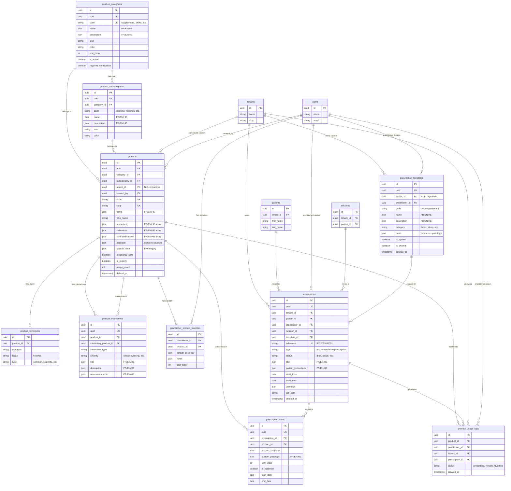

# ERD - Module Prescriptions

## Diagramme des Relations

## Légende

### Types de tables

| Symbole | Signification | RLS |
|---------|---------------|-----|
| 🌐 | Table système partagée | ❌ Non |
| 🏢 | Table multi-tenant | ✅ Oui |
| 👤 | Table liée au user | ❌ Non (filtrage applicatif) |
| 📊 | Table de logs/analytics | ❌ Non |

### Classification

**Tables système (🌐):**
- product_categories
- product_subcategories

**Tables multi-tenant (🏢):**
- products (RLS: tenant_id IS NULL OR tenant_id = current_tenant)
- prescriptions (RLS: tenant_id = current_tenant)
- prescription_templates (RLS: tenant_id IS NULL OR tenant_id = current_tenant)

**Tables héritées (sécurité du parent):**
- product_synonyms (hérite de products)
- product_interactions (hérite de products)
- prescription_items (hérite de prescriptions)

**Tables utilisateur (👤):**
- practitioner_product_favorites (filtrage par practitioner_id)

**Tables analytics (📊):**
- product_usage_logs

## Relations clés

### Produits
- Un produit appartient à **1 catégorie** (obligatoire)
- Un produit appartient à **0-1 sous-catégorie** (optionnel)
- Un produit peut être **système** (tenant_id=NULL) ou **custom** (tenant_id défini)
- Un produit système est visible par **tous les tenants**
- Un produit custom n'est visible que par **son tenant**

### Prescriptions
- Une prescription appartient à **1 tenant** (obligatoire)
- Une prescription est pour **1 patient** (obligatoire)
- Une prescription est créée par **1 praticien** (obligatoire)
- Une prescription peut être liée à **0-1 session**
- Une prescription peut être basée sur **0-1 template**
- Une prescription contient **N items** (produits prescrits)

### Templates
- Un template peut être **système** (tenant_id=NULL) ou **custom** (tenant_id défini)
- Un template custom peut être **personnel** (practitioner_id défini) ou **partagé** (is_shared=true)
- Un template partagé est visible par tous les praticiens du même tenant

### Interactions
- Un produit peut avoir **N interactions** avec d'autres produits, médicaments, ou conditions
- Les interactions peuvent être **négatives** (contraindications) ou **positives** (synergies)
- Chaque interaction a une **sévérité**: critical, warning, info, positive

## Index critiques

### Recherche de produits
- `products.code` (UK)
- `products.slug` (UK)
- `products.latin_name`
- `product_synonyms.synonym`

### Filtrage tenant
- `products.tenant_id`
- `prescriptions.tenant_id`
- `prescription_templates.tenant_id`

### Recherche patient
- `prescriptions.[patient_id, status]` (composite)

### Analytics
- `product_usage_logs.[product_id, created_at]`
- `product_usage_logs.[practitioner_id, created_at]`
- `product_usage_logs.[tenant_id, created_at]`

### Alertes
- `product_interactions.severity`
- `product_interactions.is_active`

## Contraintes d'unicité

| Table | Contrainte | Raison |
|-------|-----------|--------|
| product_categories | code | Code système unique |
| product_subcategories | [category_id, code] | Code unique par catégorie |
| products | code | Identifiant système unique |
| products | slug | URLs SEO-friendly |
| prescriptions | reference | Numéro de prescription unique |
| prescription_templates | [tenant_id, code] | Code unique par tenant |
| practitioner_product_favorites | [practitioner_id, product_id] | 1 favori par produit/praticien |

## Cascade onDelete

| Relation | onDelete | Raison |
|----------|----------|--------|
| category → products | CASCADE | Si catégorie supprimée, ses produits aussi |
| product → synonyms | CASCADE | Si produit supprimé, ses synonymes aussi |
| product → interactions | CASCADE | Si produit supprimé, ses interactions aussi |
| prescription → items | CASCADE | Si prescription supprimée, ses items aussi |
| tenant → prescriptions | CASCADE | Si tenant supprimé, ses prescriptions aussi |
| subcategory → products | SET NULL | Produit garde catégorie parent |
| session → prescriptions | SET NULL | Prescription reste si session supprimée |
| product → prescription_items | SET NULL | Item garde snapshot si produit supprimé |
